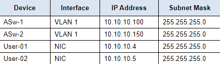
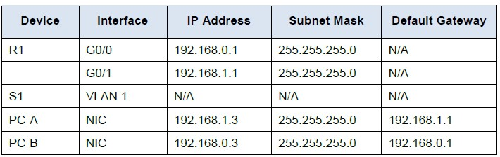
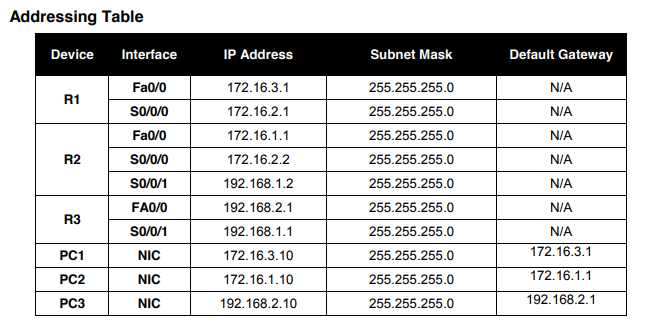

# Testplan taak 1: Basisconfiguratie switch

Auteur(s) testplan: Vic Rottiers
## Algemeen:
-   Kijk of alle kabels juist zijn aangesloten:
    -   Copper Straight-Through kabel EN Console kabel tussen ASw-1 en User-01
    -   Copper Straight-Through kabel EN Console kabel tussen ASw-2 en User-02
    -   Copper Crossover kabel tussen ASw-1 en ASw-2



## ASw-1:
1.  Verbind via Terminal (User-01 -> Desktop -> Terminal) met de switch
2.  Controleer de hostname (hetgeen dat voor het '>' teken staat)
3.  Controleer of er een MOTD staat als je in de terminal komt 
    -  Deze moet een warning zijn.
4.  Controleer of het login paswoord **R4Xe3** is 
    -  'enter to get started'
    -  Vervolgens wachtwoord ingeven
    -  Bij correct wachtwoord wordt er ingelogd en kun je in de CLI beginnen typen
5.  Controleer vervolgens het Enable wachtwoord, dit moet **C4aJa** zijn. 
    - `enable` invoeren in CLI
    - Wachtwoord ingeven
    - Bij correct wachtwoord kom je in de Enable modus
6.  Controleer vervolgens of er in de running-config wachtwoorden zichtbaar zijn
    - In de enable modus,  voer het commando `show running-config`
7. Controleer tot slot nog of de interfaces juist zijn geconfigureerd
    -  Navigeer naar de Enable modus van de CLI: `enable`
    -  Voer vervolgens `show ip interface brief` in in de CLI
    -  controleer of de VLAN overeen komt met de tabel hierboven

## ASw-2

1. Verbind via Terminal (User-02 -> Desktop -> Terminal) met de switch
2. Voer voor switch 2 dezelfde stappen uit als van switch 1 (ASw-1).
 
## User-01 & User-02
1. Ga in beide computers naar **Desktop**, vervolgens naar **IP-Configuration**
2. Controleer vervolgens of de ip's en subnet-masks overeen komen met die uit de addresseringstabel

# Testplan taak 1: Lab 1

Auteur(s) testplan: Vic Rottiers

## SW-1 en PC-A
1. Verifiëer of SW-1 verbonden is met een console kabel aan PC-A
2. Verbind via de Termninal van PC-A (Desktop -> Terminal)
3. verifiëer vervolgens of de clock van de switch de actuele tijd toont.
   - gebruik het commando `show clock`
4. In de CLI typ je vervolgens het commando `show version`
5. Indien dit commando een output teruggeeft dat de informatie van de switch toont is de configuratie geslaagd

## R1 en PC-B
1. Verifiëer of R-1 verbonden is met een console kabel aan PC-B
2. Verbind via de Termninal van PC-B (Desktop -> Terminal)
3. Als de CLI van de router verschijnt is de configuratie geslaagd.


# Testplan taak 1: Lab 2

Auteur(s) testplan: Ruby Verhoye

## S1 en S2
1. Kijk of de juiste kabel gebruikt is tussen de 2 switches (Copper Cross-Over)  
2. Kijk als voor de connectie bij allebei F0/1 gebruikt word  
3. Kijk als de kabels tussen de switches en pc's juist zijn (Copper Straight-Through)  
4. Kijk als de juiste poorten gebruikt zijn om te verbinden met pc's (F0/6 voor PC-A en F0/18 voor PC-B)  
5. Hostname moet kloppen (S1 en S2)
6. Kijk als DNS-lookup disabled is
7. Test of de wachtwoorden kloppen ("cisco" voor login en "class" om in priviliged EXEC te gaan)  

## PC-A en PC-B
1. Kijk of ip-adressen kloppen (PC-A = 192.168.1.10, PC-B = 192.168.1.11, subnet mask is voor allebei 255.255.255.0 (kan via cmd ipconfig /all))  
2. Ping van PC-A naar PC-B en omgekeerd


# Testplan taak 1: Lab 3

(Een testplan is een *exacte* procedure van de handelingen die je moet uitvoeren om aan te tonen dat de opdracht volledig volbracht is en dat aan alle specificaties voldaan is. Een teamlid moet aan de hand van deze procedure in staat zijn om de tests uit te voeren en erover te rapporteren (zie testrapport). Geef bij elke stap het verwachte resultaat en hoe je kan verifiëren of dat resultaat ook behaald is. Kies zelf de structuur: genummerde lijst, tabel, secties, ... Verwijder deze uitleg als het plan af is.)

Auteur(s) testplan: Pieter Van Keer

## Zijn de ip adressen goed geconfigureerd?



### PC-A
1. Open de ip configuratie op PC-A (PC-A --> iP Configuration)
2. is het ipv4 adres, subnet mask en default gateway ingesteld volgens de adresserings tabel?

### PC-B
3. volg stap 1 en 2 voor PC-B

### R1
4. open de cli op R1
   -  het password is **cisco**
5. maak gebruik van het commando `show ip interface brief` en bekijk de ip adressen

## Connectie testen

6. ping van PC-A naar PC-B, maak gebruik van het commando `ping <ip-adres PC-B>` (kijk in de adresserings tabel voor het ip-adres)
7. ping van PC-B naar PC-A, maak gebruik van het commando `ping <ip-adres PC-A>` (kijk in de adresserings tabel voor het ip-adres)

# Testplan taak 1: Lab 4

Auteur(s) testplan: Maurits Monteyne

## Toestelconfiguratie controleren



### R1
1. R1 klikken > CLI
2. Voer volgende commando's in:
    ```
    > Password: cisco
    > R1> enable
    > Password: class
    > R1# show ip route
    ```
3. Controleer of de output onderstaande lijnen bevat:
    ```
    Gateway of last resort is 172.16.2.2 to network 0.0.0.0

        172.16.0.0/24 is subnetted, 2 subnets
    C       172.16.2.0 is directly connected, Serial0/0/0
    C       172.16.3.0 is directly connected, FastEthernet0/0
    S*   0.0.0.0/0 [1/0] via 172.16.2.2
    ```

### R2
1. R2 klikken > CLI
2. Voer volgende commando's in:
    ```
    > Password: cisco
    > R2> enable
    > Password: class
    > R2# show ip route
    ```
3. Controleer of de output onderstaande lijnen bevat:
    ```
    Gateway of last resort is not set

        172.16.0.0/24 is subnetted, 3 subnets
    C       172.16.1.0 is directly connected, FastEthernet0/0
    C       172.16.2.0 is directly connected, Serial0/0/0
    S       172.16.3.0 is directly connected, Serial0/0/0
    C    192.168.1.0/24 is directly connected, Serial0/0/1
    S    192.168.2.0/24 [1/0] via 192.168.1.1
    ```

### R3
1. R3 klikken > CLI
2. Voer volgende commando's in:
    ```
    > Password: cisco
    > R3> enable
    > Password: class
    > R3# show ip route
    ```
3. Controleer of de output onderstaande lijnen bevat:
    ```
    Gateway of last resort is not set

        172.16.0.0/22 is subnetted, 1 subnets
    S       172.16.0.0 [1/0] via 192.168.1.2
    C    192.168.1.0/24 is directly connected, Serial0/0/1
    C    192.168.2.0/24 is directly connected, FastEthernet0/
    ```

### PC1
1. PC1 klikken > Desktop > IP Configuration
2. Controleer of de waarden overeenkomen met de addressing table

### PC2
1. PC2 klikken > Desktop > IP Configuration
2. Controleer of de waarden overeenkomen met de addressing table

### PC3
1. PC3 klikken > Desktop > IP Configuration
2. Controleer of de waarden overeenkomen met de addressing table


## Connectie testen

### PC1
1. PC1 klikken > Desktop > Command Prompt
2. Pingen van PC2 via het commando `ping <ip-adres PC2>` moet succesvol verlopen.
3. Pingen van PC3 via het commando `ping <ip-adres PC3>` moet succesvol verlopen.

### PC2
1. PC2 klikken > Desktop > Command Prompt
2. Pingen van PC1 via het commando `ping <ip-adres PC1>` moet succesvol verlopen.
3. Pingen van PC3 via het commando `ping <ip-adres PC3>` moet succesvol verlopen.

### PC3
1. PC3 klikken > Desktop > Command Prompt
2. Pingen van PC1 via het commando `ping <ip-adres PC1>` moet succesvol verlopen.
3. Pingen van PC2 via het commando `ping <ip-adres PC2>` moet succesvol verlopen.
