# Testrapport taak 1: Basisconfiguratie switch

## Test 1.0

Uitvoerder(s) test: Pieter Van Keer  
Uitgevoerd op: 22/02/2021  
Github commit:  cbf20d9d2ba74fdb384dc56645bc11f9542c9ba0

### Algemeen
De kabels lijken goed aangesloten. 
ik zie:
    -   Copper Straight-Through kabel EN Console kabel tussen ASw-1 en User-01
    -   Copper Straight-Through kabel EN Console kabel tussen ASw-2 en User-02
    -   Copper Crossover kabel tussen ASw-1 en ASw-2

### ASw-1
1. verbinding gelukt
2. De hostname is "ASw-1", dit is correct
3. De motd "warming, unauthorized access is strictly forbidden" staat op het scherm, dit is correct
4. De terminal vraagt een wachtwoord om toegang te krijgen tot de CLI, en **R4Xe3** is correct
5. De terminal vraagt een wachtwoord om toegang te krijgen tot de enable-mode, en **C4aJa** is correct
6. ik zag enkel wachtwoorden die encrypted waren.

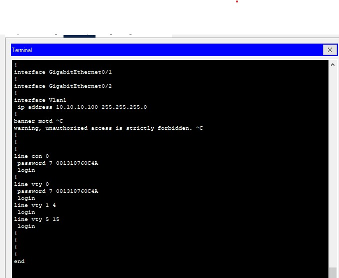

7. Het ip-adres van Vlan1 is 10.10.10.100 dit is correct

### ASw-2
1. verbinding gelukt
2. De hostname is "ASw-2", dit is correct
3. De motd "warming, unauthorized access is strictly forbidden" staat op het scherm, dit is correct
4. De terminal vraagt een wachtwoord om toegang te krijgen tot de CLI, en **R4Xe3** is correct
5. De terminal vraagt een wachtwoord om toegang te krijgen tot de enable-mode, en **C4aJa** is correct
6. ik zag enkel wachtwoorden die encrypted waren.
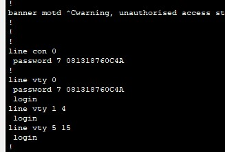
7. Het ip-adres van Vlan1 is 10.10.10.150 dit is correct

## User-01 & User-02
1. Ga in beide computers naar **Desktop**, vervolgens naar **IP-Configuration**
2.  user-01: 10.10.10.4, user-02: 10.10.10.5

# Testrapport taak 1: Lab 1

## Test 1.0

Uitvoerder(s) test: Pieter Van Keer
Uitgevoerd op: 22/02/2021
Github commit:  COMMIT HASH

## SW-1 en PC-A
1. SW-1 en PC-A zijn verbonden met een console kabel
2. Verbinding gelukt
3. De clock is ingesteld
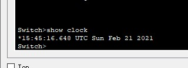
4. In de CLI typ je vervolgens het commando `show version`
5. er wordt output weergegeven

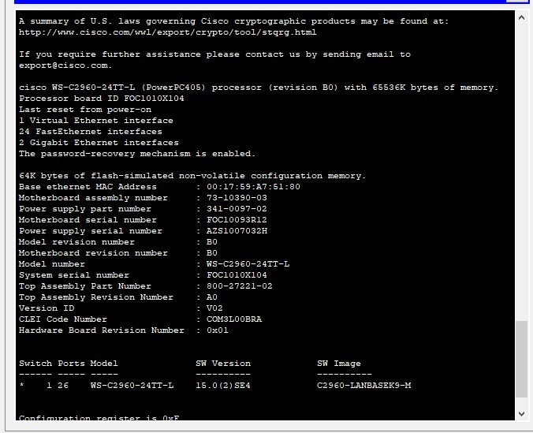

## R1 en PC-B
1. R1 en PC-B zijn verbonden met een console kabel
2. Verbinding gelukt
3. CLI wordt weergegeven

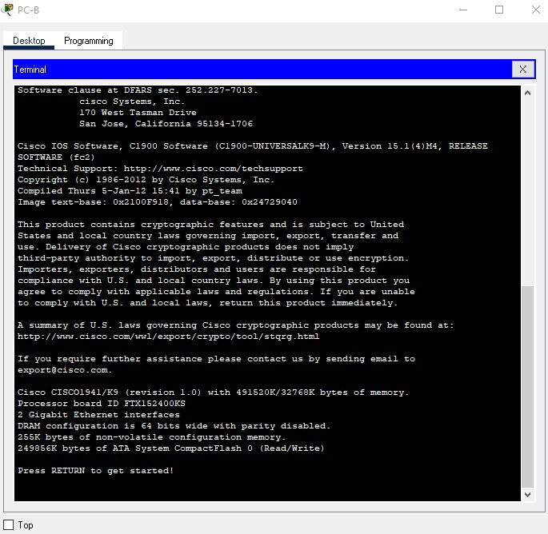

# Testrapport taak 1: Lab 2

## Test 1.0

Uitvoerder(s) test: Maurits Monteyne<br>
Uitgevoerd op: 1/03/2021<br>
Github commit:  [d2fc2356b007adb8fad35a7d19a68f3fec0150ca](https://github.com/HoGentTIN/p2ops-2021-g02/commit/d2fc2356b007adb8fad35a7d19a68f3fec0150ca)

### S1 en S2
1. Kabel die de twee switches verbindt is een Copper Cross-Over
2. Beide switches gebruiken poort F0/1
3. De pc's zijn beide verbonden met een switch met Copper Straight-Through kabels
4. PC-A is verbonden met poort F0/6, maar PC-B met F0/19 ipv F0/18 (!)

**=> Test faalt**

## Test 2.0

Uitvoerder(s) test: Maurits Monteyne<br>
Uitgevoerd op: 1/03/2021<br>
Github commit:  [edb4d9d1cf8ee4006b19df73d4416858011482f2](https://github.com/HoGentTIN/p2ops-2021-g02/commit/edb4d9d1cf8ee4006b19df73d4416858011482f2)

### S1 en S2
1. Kabel die de twee switches verbindt is een Copper Cross-Over.
2. Beide switches gebruiken poort F0/1.
3. De pc's zijn beide verbonden met een switch met Copper Straight-Through kabels.
4. PC-A is verbonden met poort F0/6 en PC-B met F0/18.
5. Beide hostnames kloppen.
6. DNS-lookup is op beide switches uitgeschakeld.
7. Password voor EXEC-mode (**cisco**) en Privilege EXEC-mode (**class**) zijn ingesteld op beide switches.

### PC-A en PC-B
1. IP-adres en subnet mask zijn correct op beide pc's.
2. Pingen van PC-A naar PC-B is succesvol.
    ```
    C:\>ping 192.168.1.11

    Pinging 192.168.1.11 with 32 bytes of data:

    Reply from 192.168.1.11: bytes=32 time<1ms TTL=128
    Reply from 192.168.1.11: bytes=32 time<1ms TTL=128
    Reply from 192.168.1.11: bytes=32 time<1ms TTL=128
    Reply from 192.168.1.11: bytes=32 time=1ms TTL=128

    Ping statistics for 192.168.1.11:
        Packets: Sent = 4, Received = 4, Lost = 0 (0% loss),
    Approximate round trip times in milli-seconds:
        Minimum = 0ms, Maximum = 1ms, Average = 0ms
    ```
    Pingen van PC-B naar PC-A is succesvol.
    ```
    C:\>ping 192.168.1.10

    Pinging 192.168.1.10 with 32 bytes of data:

    Reply from 192.168.1.10: bytes=32 time=4ms TTL=128
    Reply from 192.168.1.10: bytes=32 time<1ms TTL=128
    Reply from 192.168.1.10: bytes=32 time<1ms TTL=128
    Reply from 192.168.1.10: bytes=32 time<1ms TTL=128

    Ping statistics for 192.168.1.10:
        Packets: Sent = 4, Received = 4, Lost = 0 (0% loss),
    Approximate round trip times in milli-seconds:
        Minimum = 0ms, Maximum = 4ms, Average = 1ms
    ```

# Testrapport taak 1: Lab 3

## Test 1.0

Uitvoerder(s) test: Vic Rottiers
Uitgevoerd op: 22/02/2021
Github commit:  fd8ecbd8cf01388fbd9706afa61dc7ecff701f65

### Zijn de ip adressen goed geconfigureerd?
### PC-A
1. Is gelukt
2. Ja, het ipv4 adres is hetzelfde.

### PC-B
3. Stap 1 en 2:
   1. Gelukt
   2. Ja, het ipv4 adres is hetzelfde.

### R1
4. Password is correct (**cisco**).
5. Commando is gelukt, de interfaces zijn juist geconfigureerd.

### Connectie testen
6. Ping van PC-A naar PC-B is gelukt, de eerste request was timed out maar alle andere requests kregen replies.
7. Ping van PC-B naar PC-A is gelukt, alle 4 requests kregen een reply.

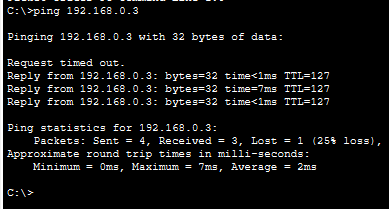
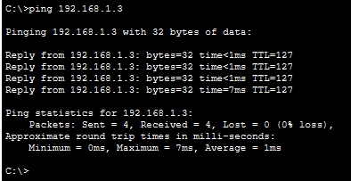
# Testrapport taak 1: Lab 4

## Test 1.0

Uitvoerder(s) test: Vic Rottiers
Uitgevoerd op: 26/02/2021
Github commit:  5e16c1d51690decc93187af46468e63168fc80ff

### **Toestelconfiguratie controleren**
### R1
1. Gelukt.
2. Commando's gelukt.
3. De outputlijnen zijn hetzelfde.

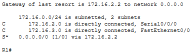

### R2
1. Gelukt.
2. Commando's gelukt.
3. De outputlijnen zijn hetzelfde.

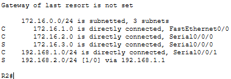

### R3
1. Gelukt.
2. Commando's gelukt.
3. De outputlijnen zijn hetzelfde.

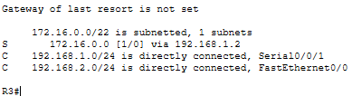

### PC1
1. Gelukt.
2. Waarden komen overeen met de addressing table.

### PC2
1. Gelukt.
2. Waarden komen overeen met de addressing table.

### PC3
1. Gelukt.
2. Waarden komen overeen met de addressing table.

### **Connectie testen**
### PC1
1. Gelukt.
2. 1ste ping timed out, maar de andere 3 slagen -> OK.
3. 1ste ping timed out, maar de andere 3 slagen -> OK.

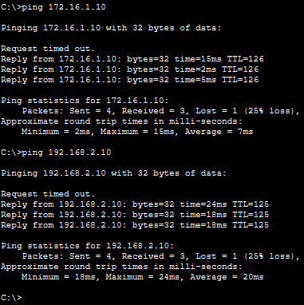

### PC2
1. Gelukt.
2. Alle 4 pings slagen -> OK.
3. Alle 4 pings slagen -> OK.

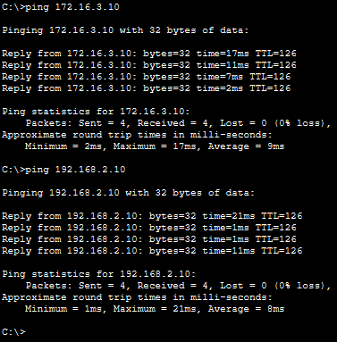

### PC3
1. Gelukt.
2. Alle 4 pings slagen -> OK.
3. Alle 4 pings slagen -> OK.

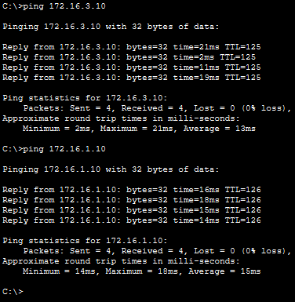
