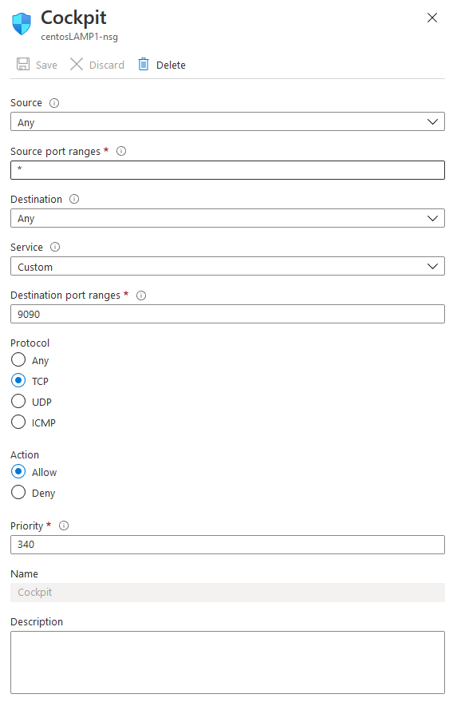

# Gebruikersdocumentatie

## M1: lokale testomgeving opzetten

### Server.conf aanpassen

Om het script te laten voldoen aan de gebruiker kan je enkele dingen configureren. Hiervoor gebruiken we `testomgeving/provision/server.config`

```bash
#------------------------------------------------------------------------------
# MariaDB
#------------------------------------------------------------------------------
# Root password
mariadb_root_password="mariadb"

# Wordpress
mariadb_db_name="wordpress_db"
mariadb_username="wp_usr"
mariadb_password="wp_psswrd"
```

Tussen de aanhalingstekens vul je de gewenste waarde in:
- `mariadb_root_password` is het wachtwoord dat je wenst in te stellen voor de root gebruiker.
- `mariadb_db_name` is de naam van de databank die wordt aangemaakt tijdens de setup.
- `mariadb_username` is de naam van de gebruiker die je wenst aan te maken binnen wordpress.
- `mariadb_password` is het wachtwoord van de gebruiker die je wenst aan te maken binnen wordpress


Nadat je de `server.conf` hebt aangevuld kan je de machine opstarten

### Terminal openen

1. Zorg ervoor dat je een terminal venster open hebt
> In Vscode kan je dit doet via `Terminal` --> `New Terminal`
2. Navigeer naar de map `testomgeving`
> Als je je in de root van deze repository bevindt kan je gebruik maken van het commando `cd .\opdracht02\testomgeving\`

### VM opstarten

1. Gebruik het commando: `vagrant up srv001` om de machine te starten.
2. Wacht tot deze is opgestart en open een browser. Zoek naar de url `http://192.168.56.31/wordpress`

## M3: productie-omgeving opzetten

### VM aanmaken op Azure

Virtual machines --> add Virtual Machine

Kies als besturingsysteem **Centos8.2**

Doorloop de wizard. 

### Authenticatie

Bij authenticatie kan je kiezen voor een wachtwoord te gebruiken of een ssh key.
Kies hier voor wachtwoord
gebruiker: **student**
wachtwoord: **Student123456**

Nu is de VM aangemaakt en gaan we het script aanpassen


### SSH naar de machine

open Putty of een andere soortgelijke applicatie.

Het is ip kan je bekijken op het portaal van Azure
username: student
wachtwoord: Student123456

Eenmaal er een verbinding is naar de machine dan kunnen we de server.conf aanpassen.

### Server.conf aanpassen

Om het script te laten voldoen aan de gebruiker kan je enkele dingen configureren. Hiervoor gebruiken we `~/scripts/server.config`

```bash
#------------------------------------------------------------------------------
# MariaDB
#------------------------------------------------------------------------------
# Root password
mariadb_root_password="mariadb"

# Wordpress
mariadb_db_name="wordpress_db"
mariadb_username="wp_usr"
mariadb_password="wp_psswrd"
```

Tussen de aanhalingstekens vul je de gewenste waarde in:
- `mariadb_root_password` is het wachtwoord dat je wenst in te stellen voor de root gebruiker.
- `mariadb_db_name` is de naam van de databank die wordt aangemaakt tijdens de setup.
- `mariadb_username` is de naam van de gebruiker die je wenst aan te maken binnen wordpress.
- `mariadb_password` is het wachtwoord van de gebruiker die je wenst aan te maken binnen wordpress

Nadat je de waarden in de server.conf hebt aangepast naar de gewenste waarden kunnen we het script runnen.

### srv001.sh uitvoeren

Verifieer dat `srv001.sh, common.sh, util.sh en webapp_install.sh` uitvoerbaar zijn.

voor `srv001.sh` uit, maak gebruik van het commando: `sudo ./srv001.sh`.
Laat het script runnen en na afloop is de lampstack geïnstalleerd. 

### Poorten openzetten

Ga naar het portal van Azure en navigeer naar jouw Network Security Group.
Maak 2 regels aan voor de inbound ports.
1. voor de service http
2. voor de service https
3. poort 9090 voor cockpit

