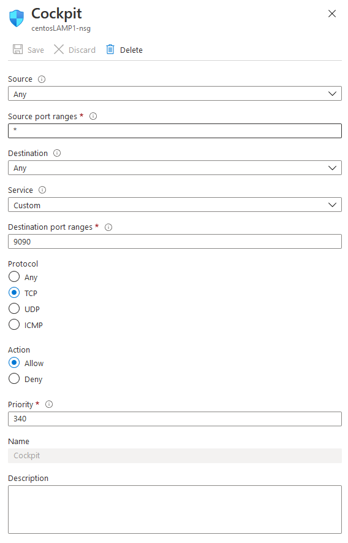
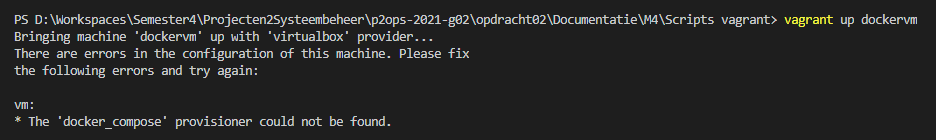
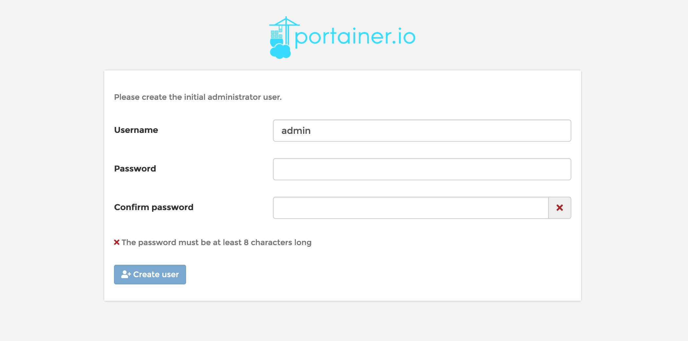
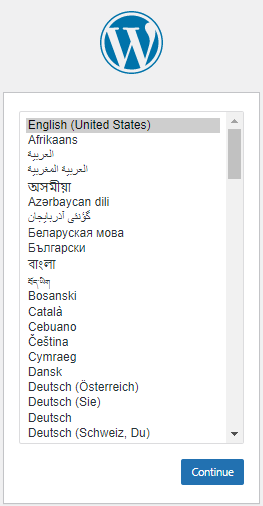

# Technische documentatie
## M1

M1 bestaat uit 2 delen:

- Installatiescript voor het applicatieplatform
- Installatiescript voor de webapplicatie

### Applicatieplatform

Het script begint met het installeren van httpd (apache), Mariadb, PHP.
```bash
# Apache
yum -y install httpd
log "Apache installed"

# MariaDB
yum -y install mariadb-server
log "MariaDB installed"

# PHP
yum -y module reset php
yum -y module enable php:7.4
yum -y install php php-mysqlnd
log "PHP installed"
```
Nadat de installatie is gebeurt moet je de services starten. Wij gebruiken `enable` zodat de service gestart wordt wanneer de machine opstart. `--now` geeft aan dat de service onmiddelijk moet gestart worden.
```bash
# Apache
systemctl enable --now httpd
log "Apache enabled"

# MariaDB
systemctl enable --now mariadb
log "MariaDB enabled"

# Firewall
systemctl enable --now firewalld
log "Firewall enabled"
```
Controleren of de services wel degelijk gestart zijn kan je met het commando `systemctl status <applicatie>`

Als de services gestart zijn gaan we de machine beveiligen, dat gebeurt aan de hand van onderstaande commando's:

```bash
# Firewall
firewall-cmd --add-service ssh --permanent
firewall-cmd --add-service http --permanent
firewall-cmd --add-service https --permanent
firewall-cmd --reload
log "Firewall configured"

# SELinux
setenforce 1
sed -i 's/^SELINUX=.*/SELINUX=enforcing/' /etc/selinux/config
log "SELinus set to enforcing"
```

We maken ssh, http en https mogelijk door deze toe te voegen aan de firewall. SELinux staat op enforcing

Nu is het tijd om de databank te configureren.  

Het is belangrijk dat we:
- Root password instellen
- De test db en testgebruiker verwijderen
- Nieuwe db en gebruiker aanmaken
- Remote login niet mogelijk maken

### Webapplicatie

Het script start met de nodige databases, gebruikers aan te maken en rechten toe te kennen.
De salts voor wordpress worden ook geupdate.

Wordpress wordt gedownload, geinstalleerd en geconfigureerd


## M2

M2 bestaat uit 2 delen:

  - Installatiescript aanpassen om ook Cockpit te installeren
  - Een load test uitvoeren op de webserver vanaf het fysieke systeem

Installatie van Cockpit
```bash
dnf install cockpit -y
```

Cockpit starten
```bash
systemctl start cockpit.socket
systemctl enable cockpit.socket
```

De firewall openzetten voor cockpit
```bash
firewall-cmd --permanent --add-service=cockpit
firewall-cmd --reload
```

## M3

### VM aanmaken op Azure

Virtual machines --> add Virtual Machine

Kies als besturingsysteem **Centos8.2**

Doorloop de wizard. 

### Authenticatie

Bij authenticatie kan je kiezen voor een wachtwoord te gebruiken of een ssh key.
Kies hier voor wachtwoord
gebruiker: **student**
wachtwoord: **Student123456**

Nu is de VM aangemaakt en gaan we het script aanpassen

### script aanpassen

pas op lijn 18 van *srv001.sh* het pad **"/vagrant/provisioning/"** aan naar **"."**

### scripts op vm zetten

zet de scripts (srv001.sh, common.sh, util.sh, webapp_install.sh, server.conf) over naar de VM. hiervoor kan je gebruik maken van FileZilla

### ssh naar vm

open Putty of een andere soortgelijke applicatie.

Het is ip kan je bekijken op het portaal van Azure
username: student
wachtwoord: Student123456

### scripts uitvoerbaar maken

maak de scripts uitvoerbaar

> je kan gebruik maken van het commando: `chmod 764 <scriptnaam>`

### scripts uitvoeren

voor volgend commando uit om de installatie te starten: `sudo ./srv001.sh`

De scripts worden nu uitgevoerd

### Poorten openzetten

Ga naar het portal van Azure en navigeer naar jouw Network Security Group.
Maak 2 regels aan voor de inbound ports.
1. voor de service http
2. voor de service https
3. poort 9090 voor cockpit



## M4 Containervirtualisatie

Login credentials voor cockpit:<br>
Username: vagrant<br>
Password: vagrant<br>

Login credentials voor Portainer:<br>
Username: vagrant<br>
Password: 123Geheim_<br>

## **Installatie aan de hand van Vagrant**

1. Open een terminal in volgend pad: <br>
   `p2ops-2021-g02\opdracht02\Documentatie\M4\Scripts vagrant`
2. Voer volgend commando in in de terminal: <br>
   `vagrant up dockervm`

Indien er zich volgende error voordoet:


Dit is te fixen met volgend commando in de terminal:<br>
`vagrant plugin install vagrant-docker-compose`

## **Handmatige installatie**

De uitvoering van deze opdracht bestaat uit volgende delen:
  1. Aanmaak van de VM
  2. Installatie Docker en Cockpit
  3. Installatie / Configuratie van de containers met Docker Compose
  4. Load tests 

### **1. Aanmaak VM**
Eerst maken we een VM aan met volgende configuratie:
- 2 CPU cores, 4gb ram, 15gb hdd.
- 2 NIC's:
  - 1 NAT nic
  - 1 Host-only adapter
- Linux ubuntu live server als OS.
  - Geen proxy address instellen
  - Alle instellingen onveranderd laten
  - Bij `Profile Setup`: 
    - Name, Server Name en Username: `dockervm`
    - Password: `123Geheim_`
  - Bij de prompt of OpenSSH moet geinstalleerd zijn vink je dit aan.
  - Installation van features: negeren
  - Na installatie VM rebooten en installatiemedia uitwerpen.

**Username**: dockervm

**Wachtwoord**: 123Geheim_

Bovenstaand Username en password zijn van toepassing bij elke login op de server.
### **2. Installatie Docker, Cockpit  en Portainer container** 
- in Ubuntu Server, geef volgende stappen in de terminal in:
    ```bash
    sudo apt-get update

    sudo apt-get install \
        apt-transport-https \
        ca-certificates \
        curl \
        gnupg \
        lsb-release
    
    curl -fsSL https://download.docker.com/linux/ubuntu/gpg | sudo gpg --dearmor -o /usr/share/keyrings/docker-archive-keyring.gpg
    
    echo \
      "deb [arch=amd64 signed-by=/usr/share/keyrings/docker-archive-keyring.gpg] https://download.docker.com/linux/ubuntu \
      $(lsb_release -cs) stable" | sudo tee /etc/apt/sources.list.d/docker.list > /dev/null
    
    sudo apt-get update

    sudo apt-get install docker-ce docker-ce-cli containerd.io

    # verifiëer of docker correct is geïnstalleerd
    sudo docker run hello-world
  ```
- Cockpit geinstalleerd via volgend commando:
  ```bash
  sudo apt-get install cockpit
  ```
  Als Cockpit is geïnstalleerd kan je via `ipadres:9090` naar de web ui van Cockpit surfen

- Om de containers te kunnen managen maken we gebruik van een Portainer container
  
  Typ volgende commands in de cli van de server:
  ```bash
  sudo docker volume create portainer_data

  sudo docker run -d -p 8000:8000 -p 9000:9000 --name=portainer --restart=always -v /var/run/docker.sock:/var/run/docker.sock -v portainer_data:/data portainer/portainer-ce
  ```
  Normaal kun je nu naar de Web UI van Portainer surfen op het ip adres van de VM met poort `:9000` achteraan. Deze pagina ziet er ongeveer als volgt uit:

  

### **3. Installatie / Configuratie van de containers met Docker Compose**
we gebruiken Docker Compose om het aanmaken van de containers te automatiseren.

-  Installatie Docker Compose:
   ```bash
   # In de terminal, voer volgende commando's uit:
   sudo curl -L "https://github.com/docker/compose/releases/download/1.28.5/docker-compose-$(uname -s)-$(uname -m)" -o /usr/local/bin/docker-compose
   
   sudo chmod +x /usr/local/bin/docker-compose

   # Verifiëer of de installatie gelukt is:
   sudo docker-compose --version
   ```

- Installatie / Configuratie containers:
   ```bash
   # Maak een map aan waar je het .yml bestand in gaat opslagen:
   mkdir wordpress

   cd wordpress

   # Maak vervolgens het .yml bestand aan (de naam mag je zelf kiezen):
   touch docker-compose.yml
   nano docker-compose.yml

   # Copy past vervolgens volgende lijnen code in de .yml file:
   version: "3.9"
   
   services:
     db:
       image: mysql:5.7
       volumes:
         - db_data:/var/lib/mysql
       restart: always
       environment:
         MYSQL_ROOT_PASSWORD: <PASSWORD>
         MYSQL_DATABASE: wordpress
         MYSQL_USER: <USER>
         MYSQL_PASSWORD: <PASSWORD>
   
     wordpress:
       depends_on:
         - db
       image: wordpress:latest
       ports:
         - "80:80"
       restart: always
       environment:
         WORDPRESS_DB_HOST: db:3306
         WORDPRESS_DB_USER: <USER>
         WORDPRESS_DB_PASSWORD: <PASSWORD>
         WORDPRESS_DB_NAME: wordpress
   volumes:
     db_data: {}

   # Als deze lijnen in de file staan -> save file
   # Vervolgens de file uitvoeren: 
   sudo docker-compose up -d
   ```

   Enkele lijnen uitgelegd:
   -  De lijnen waar er `<USER>` of `<PASSWORD>` staat mogen aangepast worden met een Username of Password naar keuze
  
       (in ons geval gebruiken we dus `dockervm` en `123Geheim_` als Username en Password)
    - De ports kunnen ook aangepast worden moest die gewenst zijn. 80:80 is de default, hierdoor kunnen we gewoon naar het IP surfen zonder dat we een poort moeten meegeven.

  MariaDB en Wordpress is nu geïnstalleerd in 2 aparte containers, je kan controleren of het werkt door naar het ip adres van de VM te surfen op je fysiek systeem.

  Normaal gezien zie je het volgende verschijnen:

  
  
### **4. Load tests**

Voor de load tests maken we gebruik van HTTPERF. Om dit te kunnen gebruiken hebben we een linux machine nodig.

#### **Aanmaak Fedora VM**

1. Maak een VM aan in Virtualbox met volgende specificaties:
   - 4GB RAM
   - 3 CPU cores
   - 15GB harde schijf
   - Fedora 64 ISO: (https://getfedora.org/nl/workstation/download/)

2. Installeer de Fedora OS op de VM.
    - Basic configuratie, geen extra services / instellingen aanduiden
    - Username & Password:
      - Username: dockertest
      - password: 123Geheim_

3. Op de Fedora VM, voer volgende commando's uit op de CLI:
    ``` 
      sudo dnf update
      
      sudo dnf install httperf
    ```
4. Controlleer of httperf is geinstalleerd door het commando `httperf -v` uit te voeren