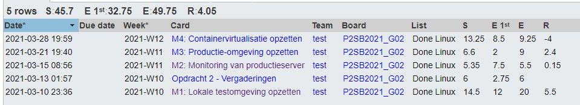

# Lastenboek Taak 2: Automatiseren opzetten Linux-servers

## Deliverables

* M1: lokale testomgeving
    - Vagrant-omgeving met 1 VM
    - Installatie-script webserver + database
    - Installatie-script webapplicatie
    - Technische documentatie:
      - Hoe kan een teamlid (of de begeleider) de opstelling reproduceren zonder hulp?
      - Cheat sheet: wat zijn de belangrijkste commando's om de VM te beheren en om problemen op te lossen?
    - Gebruikersdocumentatie: hoe kan een PHP-developer zonder hulp de VM configureren opstarten? 
    - Testplan en -rapport

* M2: Monitoring
    - Aangepast installatiescript
    - Aangepaste technische documentatie
    - Testplan en -rapport van de load tests

* M3: Productie-omgeving
    - Aangepaste installatie-scripts zodat ze zowel lokaal als in de gekozen cloud-omgeving bruikbaar zijn
    - Technische documentatie: hoe kan een teamlid de opstelling reproduceren?
    - Gebruikersdocumentatie: hoe kan een klant een webapplicatieserver in een productie-omgeving opzetten?
    - Testplan- en rapport

* M4: Containervirtualisatie
    - Installatiescripts VM, containers
    - Technische documentatie:
      - Hoe kan een teamlid de opstelling reproduceren?
      - Aangevuld cheat sheet: belangrijkste commando's om met Docker/Podman te werken
    - Testplan en -rapport opstelling + load tests

## Deeltaken

1. **M1: Lokale testomgeving**
    - Verantwoordelijke: Maurits Monteyne, Pieter Van Keer
    - Tester: Vic Rottiers, Pieter Van Keer
2. **M2: Monitoring**
    - Verantwoordelijke: Ruby Verhoye
    - Tester: Maurits Monteyne
3. **M3: Productie-omgeving**
    - Verantwoordelijke: Pieter Van Keer
    - Tester: Vic Rottiers
4. **M4: Containervirtualisatie**
    - Verantwoordelijke: Vic Rottiers
    - Tester: Pieter Van Keer

## Tijdbesteding

| Student          | Geschat | Gerealiseerd |
| :--------------- | ------: | -----------: |
| Maurits Monteyne |      10 |           10 |
| Pieter Van keer  |   24,25 |        15,35 |
| Ruby Verhoye     |       5 |            5 |
| Vic Rottiers     |    10.5 |           15 |
| **totaal**       |   43,75 |         39,7 |

