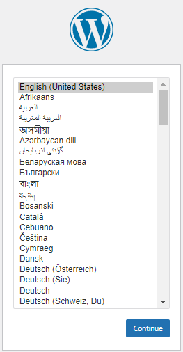

# Testplan taak 2: M1

Auteur(s) testplan: Pieter Van Keer, Maurits Monteyne

## 1. Opzetten virtual machine

1. Navigeer naar `/opdracht02/testomgeving/` en open een terminal. 

2. Gebruik het commando `vagrant status` en controleer dat de status van `srv001` op `not created` staat. Indien dit niet het geval is, vernietig eerste de VM met het commando `vagrant destroy srv001`.
    > `vagrant status` geeft informatie over de VM, in welke status die zich bevindt (aborted, suspended, running, ...)

3. Gebruik het commando `vagrant up srv001` om de VM op te starten.

## 2. Testing

Wanneer de VM zonder foutenmeldingen is opgestart kan eventueel status nog eens bekeken worden via `vagrant status srv001` en zou deze op `running` moeten staan.

1. Gebruik het commando `ping 192.168.56.31` om de connectie met de VM te verifiëren.

    Vervolgens gaan we een paar dingen nakijken op de VM. Maak gebruik van ssh om de cli van de VM over te nemen.

 2. Gebruik het commando `vagrant ssh srv001`. (Indien een wachtwoord wordt gevraagd, vul dan `vagrant` in)

### LAMP-stack controlen
3. Gebruik het commando `httpd -v` en verifieer dat:
    - Apache server geïnstalleerd is (Geen foutmelding)

4. Gebruik het commando `mysql --version` en verifieer dat:
    - MariaDB server geïnstalleerd is (Geen foutmelding)

5. Gebruik het commando `php --version` en verifieer dat:
    - PHP versie 7.4 geïnstalleerd is (Geen foutmelding)

### Services controleren

6. Maak gebruik van het commando `systemctl status httpd` om de Apache service te bekijken
    - Verifieer dat de service draait en opstart wanneer de machine opgestart wordt.

7. Maak gebruik van het commando `systemctl status mariadb` om de Mariadb service te bekijken
    - Verifieer dat de service draait en opstart wanneer de machine opgestart wordt.

8. Maak gebruik van het commando `systemctl status firewalld` om de Firewall service te bekijken
    - Verifieer dat de service draait en opstart wanneer de machine opgestart wordt.

### Beveiliging controleren

9. Gebruik het commando `sudo firewall-cmd --list-all` en verifieer dat:
   - Bij `services:` **http**, **https** en **ssh** in de lijst staan.

10. Gebruik het commendo `sudo sestatus` en verifieer dat:
    - `SELinux status:` op **enabled** staat

    - `Current mode` op **enforcing** staat

    - `Mode from config file:` op **enforcing** staat

### MariaDB controleren
11. Gebruik het commando `mysql -uroot -pmariadb -e "SHOW DATABASES"` verifieer dat:
    - Er geen test datebase bestaat

    - Er een database **wordpress_db** bestaat

12. Gebruik het commando `mysql -uroot -pmariadb -e "SELECT user, host FROM mysql.user"` verifieer dat:
    - Er geen gebruikers bestaan met een lege gebruikersnaam

    - De waarden in de **host** kolom bij de `root` gebruiker enkel overeenkomen met `localhost`, `127.0.0.1` of `::1`

### Webapplicatie controleren

13. Open een browser venster en surf naar `http://192.168.56.31` en/of `https://192.168.56.31`
    - De test pagina van **apache** wordt getoond

14. Open een browser venster en surf naar `http://192.168.56.31/wordpress` en/of `https://192.168.56.31/wordpress`
    - De setup pagina van **wordpress** wordt getoond

# Testplan taak 2: M2

Auteur testplan: Ruby Verhoye

## 1. Opzetten virtuele machine

1. Navigeer naar `p2ops-2021-g02\opdracht02\testomgeving`

2. Gebruik het commando `vagrant status` en controleer dat de status van `srv001` op `not created` staat. Indien dit niet het geval is, vernietig eerste de VM met het commando `vagrant destroy srv001`.

3. Gebruik het commando `vagrant up srv001` om de VM op te starten.

## 2. Testing

Wanneer de VM zonder foutenmeldingen is opgestart kan eventueel de status nog eens bekeken worden via `vagrant status srv001` en zou deze op `running` moeten staan.

1. Surf in de browser naar `https://192.168.56.31:9090` en log in met gebruikersnaam `vagrant` en wachtwoord `vagrant`

2. Start een linux VM op

3. Start de terminal op

4. Installeer de load testing tool httperf met `sudo dnf install httperf`

> Hiermee kan je de performantie van de webserver testen

5. Gebruik dan het commando `httperf --server 192.168.56.31 --port 443 --num-conns 100 --rate 10 --timeout 1` om 100 HTTP requests te doen naar de server en kijk of je 100 replies krijgt

6. Kijk in de browser naar de performantie van de server normaal zou je alleen een hoger netwerkverkeer moeten zien

# Testplan taak 2: M3

Auteur testplan: Pieter Van Keer

### ssh naar de VM

- ip: controleren op Azure
- user: student
- wachtwoord: Student123456

### LAMP-stack controleren
3. Gebruik het commando `httpd -v` en verifieer dat:
    - Apache server geïnstalleerd is (Geen foutmelding)

4. Gebruik het commando `mysql --version` en verifieer dat:
    - MariaDB server geïnstalleerd is (Geen foutmelding)

5. Gebruik het commando `php --version` en verifieer dat:
    - PHP versie 7.4 geïnstalleerd is (Geen foutmelding)

### Services controleren

6. Maak gebruik van het commando `systemctl status httpd` om de Apache service te bekijken
    - Verifieer dat de service draait en opstart wanneer de machine opgestart wordt.

7. Maak gebruik van het commando `systemctl status mariadb` om de Mariadb service te bekijken
    - Verifieer dat de service draait en opstart wanneer de machine opgestart wordt.

8. Maak gebruik van het commando `systemctl status firewalld` om de Firewall service te bekijken
    - Verifieer dat de service draait en opstart wanneer de machine opgestart wordt.

### Beveiliging controleren

9. Gebruik het commando `sudo firewall-cmd --list-all` en verifieer dat:
   - Bij `services:` **http**, **https** en **ssh** in de lijst staan.

10. Gebruik het commendo `sudo sestatus` en verifieer dat:
    - `SELinux status:` op **enabled** staat

    - `Current mode` op **enforcing** staat

    - `Mode from config file:` op **enforcing** staat

### MariaDB controleren
11. Gebruik het commando `mysql -uroot -pmariadb -e "SHOW DATABASES"` verifieer dat:
    - Er geen test datebase bestaat

    - Er een database **wordpress_db** bestaat

12. Gebruik het commando `mysql -uroot -pmariadb -e "SELECT user, host FROM mysql.user"` verifieer dat:
    - Er geen gebruikers bestaan met een lege gebruikersnaam

    - De waarden in de **host** kolom bij de `root` gebruiker enkel overeenkomen met `localhost`, `127.0.0.1` of `::1`

### Webapplicatie controleren

13. Open een browser venster en surf naar het ip van de machine (dit kan je vinden op het portaal van Azure)
    - De test pagina van **apache** wordt getoond

14. Open een browser venster en surf naar ip van de machine (dit kan je vinden op het portaal van Azure) gevolgd door `/wordpress`
    - De setup pagina van **wordpress** wordt getoond

# Testplan taak 2: M4

Auteur(s) testplan: Vic Rottiers

### Setup

1. start de docker vm op via Vagrant (zie technische documentatie).

### Controleren of de Web UI's werken
Het controleren van de web UI's doe je op je fysieke systeem.  
Het ip adres van de dockervm is `192.168.56.108`
1. surf naar de Cockpit Web UI, dit doe je door naar het `http://ipadres:9090` te surfen.
   1. Als je een waarschuwing krijgt dat de verbinding onveilig is, klik je links beneden op `geavanceerd` en vervolgens op de link `proceed to ipadres:9090`
   2. Je krijgt een loginscherm dat er als volgt uitziet:

        
    
   1. log vervolgens in met de username `vagrant` en password `vagrant`
   2. Je bevind je nu in het dashboard van Cockpit.
   3. Klik bij bij het tabblad `Overzicht` op `Bekijk grafieken`
   
        

2. surf naar de Portainer Web UI, dit doe je door naar het `http://ipadres:9000` te surfen. Let op dat het **http** is en niet **https** 
     1. Als je een waarschuwing krijgt dat de verbinding onveilig is, klik je links beneden op `geavanceerd` en vervolgens op de link `proceed to ipadres:9000`
     2. Je krijgt een loginscherm dat er als volgt uitziet:

        

     3. log vervolgens in met de username `dockervm` en password `123Geheim_`
     4. Je bevind je nu in het dashboard van Portainer, waar je alle containers van Docker kan bekijken en configureren.
     5. Klik links in het menu op `containers`
     6. Je krijgt een lijst van alle containers die in Docker aanwezig zijn, dit moet er zo uitzien:

        

### Controleren of Wordpress correct werkt

1. surf naar `http://ipadres`, je moet volgende Wordpress webpagina terugkrijgen:

    
