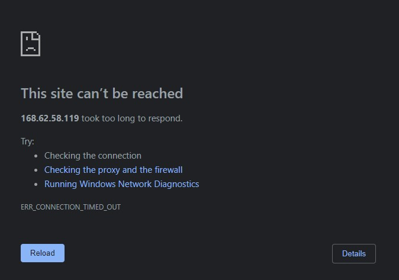

# Testrapport taak M1: Lokale testomgeving

## Test 1.0

Uitvoerder(s) test: Vic Rottiers - Pieter Van Keer 
Uitgevoerd op: 07/03/2021 
Github commit:  20cc9ad9899cd3d52369a21f0638a8eb645541ba 

1. Opzetten VM
   1. Gelukt
   2. Status op poweroff -> vagrant destroy
   3. Gelukt, VM is opgestart zonder foutmeldingen en status staat op running.

2. Testing
   1. Ping is succesvol.
   2. SSH verbinding succesvol. Wachtwoord vagrant gebruikt.

3. LAMP-Stack controleren:

   3. Apache server is geinstalleerd, geen foutmeldingen
   4. MySQL is geinstalleerd, geen foutmeldingen
   5. PHP is geinstalleerd, geen foutmeldingen

4. Services controleren:

   6. OK
   7. OK
   8. OK

5. Beveiliging controleren:

   9.  OK, http,https en ssh staan in lijst.
   10. OK, alle opties staan juist.

6. MariaDB controleren

   11. geen testdatabase, wordpress_db bestaat. OK.
   12. Klopt, geen lege usernames. OK.

7. Webapplicatie controleren: 

   13. Testpagina van apache wordt getoond. OK.
   14. Wordpress pagina wordt getoond. OK.

## Test 2.0

Uitvoerder(s) test: Maurits Monteyne 
Uitgevoerd op: 14/03/2021 
Github commit:  e48e28b9d59e89b312b6508054b405fbfb557836 

### 1. Opzetten VM
1. Gelukt
2. Status op poweroff -> vagrant destroy
3. Gelukt, VM is opgestart zonder foutmeldingen en status staat op running.

### 2. Testing
1. Gelukt
2. Ok
3. Ok
4. Installatie httperf is gelukt
5. Ok, er waren 100 requests en 100 replies
6. Ok, enkel een kleine opflakkering bij het netwerkverkeer

# Testrapport taak M3: Productieomgeving

## Test 1.0

Uitvoerder(s) test: Vic Rottiers 
Uitgevoerd op: 17/03/2021 
Github commit: 6c530b327a3cb7f9335b02287e0fdd3e0e33817b 

### SSH verbinding
- Gelukt

 ### LAMP-stack

 3. Commando gelukt, geen foutmelding
 4. Commando gelukt, geen foutmelding
 5. Commando gelukt, geen foutmelding

### Services controleren

6. Commando geslaagd, Apache service is running.
   - Service start bij opstarten.
7. Commando geslaagd, MariaDB is running.
   - Service start bij opstarten.
8. Commando geslaagd, firewalld is running.
   - Service start bij opstarten.

### Beveiliging controleren

9. Commando geslaagd, de services http, https en ssh staan in de lijst.
10. Commando geslaagd, alles staat correct ingesteld.

### MariaDB controleren
11. Commando geslaagd, geen test_db, wel een wordpress_db.
12. Commando geslaagd, alles staat correct ingesteld.

### Webapplicatie controleren

13. Niet gelukt, het ip adres geeft een timeout.
14. Niet gelukt, het ip adres geeft een timeout.

## Test 2.0

Uitvoerder(s) test: Vic Rottiers 
Uitgevoerd op: 19/03/2021 
Github commit: 2d236f8d6eb45966992e5db0dd54186d4b64a323 

### SSH verbinding
- Gelukt

 ### LAMP-stack

 3. Commando gelukt, geen foutmelding
 4. Commando gelukt, geen foutmelding
 5. Commando gelukt, geen foutmelding

### Services controleren

6. Commando geslaagd, Apache service is running.
   - Service start bij opstarten.
7. Commando geslaagd, MariaDB is running.
   - Service start bij opstarten.
8. Commando geslaagd, firewalld is running.
   - Service start bij opstarten.

### Beveiliging controleren

9. Commando geslaagd, de services http, https en ssh staan in de lijst.
10. Commando geslaagd, alles staat correct ingesteld.

### MariaDB controleren
11. Commando geslaagd, geen test_db, wel een wordpress_db.
12. Commando geslaagd, alles staat correct ingesteld.

### Webapplicatie controleren

13. Gelukt, Apache testpagina wordt getoond op 52.186.147.140 . 
14. Gelukt, Wordpress startup page wordt getoond.

# Testrapport taak M4: Containervirtualisatie

## Test 1.0

Uitvoerder(s) test: Pieter Van Keer  
Uitgevoerd op: 19/03/2021  
Github commit: ecb6eb823f09b4c6fc0c4d1a19f94cc625443551  

## Setup

1. Download en importeren gelukt.
2. Foutloos opgestart

## Controleren of de Web UI's werken

1. 192.168.56.114:9090 toont de web ui, login succesvol
2. 192.168.56.114:9000 toont web ui van portainer, login succesvol
   
## wordpress

1. 192.168.56.114 toont de wordpress pagina zoals op de foto

## Test 2.0 

Uitvoerder(s) test: Pieter Van Keer  
Uitgevoerd op: 28/03/2021  
Github commit:  d6673e42095352e4a21fd92ea8a5cd625e2e96aa

1. vm start op met vagrant, de login-pagina wordt succesvol getoond
   1. login gelukt
2. Web UI van portainer succesvol getoond
   1. login gelukt
3. De wordpress pagina wordt succesvol getoond.