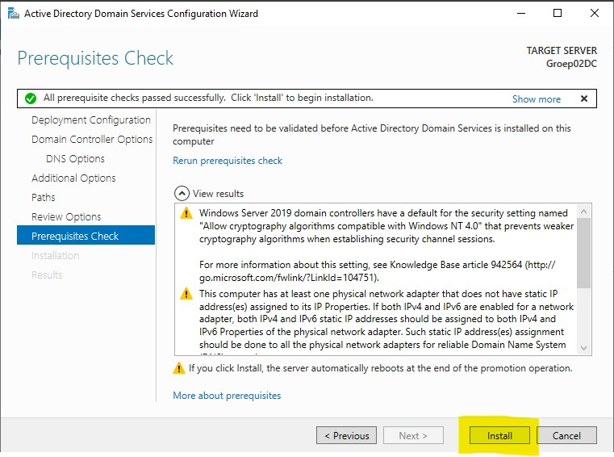
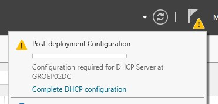
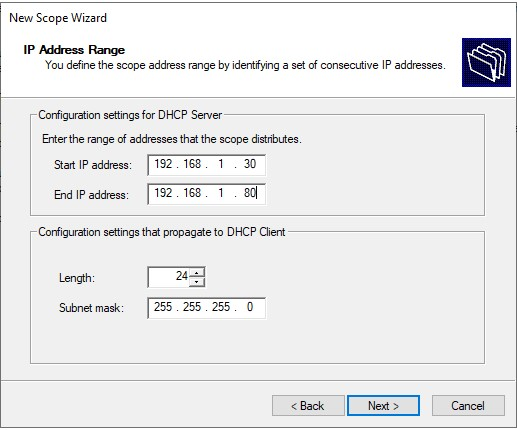

# Domein Controller

## Inhoud
- [Domein Controller](#domein-controller)
  - [Inhoud](#inhoud)
  - [1. Opzetten Windows VM](#1-opzetten-windows-vm)
    - [**Installatie Windows VMs en Installatie van de rollen**](#installatie-windows-vms-en-installatie-van-de-rollen)
    - [**Workflow voor het installeren van de virtuele machines:**](#workflow-voor-het-installeren-van-de-virtuele-machines)
  - [2. Installatie AD en DNS](#2-installatie-ad-en-dns)
    - [ADDS](#adds)
    - [DNS](#dns)
  - [3. Installatie DHCP en NAT Routing](#3-installatie-dhcp-en-nat-routing)
    - [Scope aanmaken](#scope-aanmaken)
    - [Routing](#routing)

## 1. Opzetten Windows VM
### **Installatie Windows VMs en Installatie van de rollen**
De aanmaak van verschillende virtuele machines doen we nog handmatig. We maken 2 verschillende machines aan, 1 voor de domeincontroller en een die dient als member server.

Als specificaties voor de VM's gebruiken we 2 CPU cores en 3GB ram. Je mag natuurlijk altijd meer nemen als dit, afhankelijk van je fysieke PC. Ook wordt er een vHDD aangemaakt van minimum 25GB.

**Domeincontroller:**  
De 1ste netwerkadapter is een `NAT` adapter, de 2de adapter is een `Internal Network` adapter, met als naam `winnet`. 

Om windows server te installeren op de 2 servers maken we gebruik van deze Windows Server ISO:  
https://hogent-my.sharepoint.com/:u:/g/personal/vic_rottiers_student_hogent_be/ESBZSoXB_q9DhlVAh-rsSRwBHJ18-1YVmZS50JmcLOW1Qg?e=7gx406  
### **Workflow voor het installeren van de virtuele machines:**
1. Maak vm aan aan de hand van de specificaties
2. Installeer windows server aan de hand van de ISO
3. Installeer virtual box guest additions (bij Devices, 'Insert Guest Additions', voer dit vervolgens uit in verkenner voor de installatie te starten)
4. Voer windows updates uit
5. Voer het script initial-setup.ps1 uit, dit staat in de scripts map (check vooral eerst de settings.json file, hierin staan alle gegevens die worden gebruikt om de basis instellingen te configureren)

## 2. Installatie AD en DNS

### ADDS
- In de Server manager, klik in het dashboard op 'Add roles and features.  
Klik vervolgens 3 keer op next -> vink `Active Directory Domain Services` aan. klik vervolgens op `Add Features` als er een popup verschijnt.

- Klik vervolgens nog 3 keer op next -> `Install`

- Na de installatie kan je op `close` klikken.

- Klik vervolgens in de server manager op het vlagje en op `Promote this server to a domain controller`: 

- Vink de `Add a new forest` optie aan -> vul in de Root domain name 'CoronaPrj.local' (zonder de ' ') -> klik op next.

- Vul een DSRM wachtwoord in en druk op 2x op next -> NetBIOS naam moet je niet aanpassen -> next.

- Verder blijf je op next klikken tot je op de install knop kan klikken 

- Normaal gezien start de server nu automatisch opnieuw op. Indien niet start je hem handmatig opnieuw op.

### DNS

Klik in de server manager op tools -> DNS

Dubbelklik op `GROEP02DC` -> Rechtermuisklik op 'Reverse lookup zone', 'New Zone'

Klik 4 keer op next tot je een network ID moet invullen, vul hier `192.168.1.0` in. -> klik op next tot je door de wizard door bent.
De reverse lookup zone is normaal aangemaakt nu.

## 3. Installatie DHCP en NAT Routing

- In de Server manager, klik in het dashboard op 'Add roles and features.  
Klik vervolgens 3 keer op next -> vink `DHCP` aan. klik vervolgens op `Add Features` als er een popup verschijnt. 

- Klik vervolgens nog 3 keer op next -> `Install`

- Klik vervolgens in de server manager op het vlagje en op `Complete DHCP configuration`: 

- In de post install wizard klik je op next en vink je vervolgens `Skip AD authorization` aan. -> Commit -> Close

- In de Server manager, klik in het dashboard op 'Add roles and features.  
Klik vervolgens 3 keer op next -> vink `Remote Access` aan.  

- Klik vervolgens nog 3 keer op next -> vink Routing aan , Add features -> 3x Next -> `Install`

### Scope aanmaken

Klik in de server manager op Tools -> DHCP

Dubbelklik op de server links in de lijst -> Rechtermuisklik op IPv4 -> New Scope

Next -> Naam en Description invullen -> Next -> IP address Range invullen, alsook het subnetmask vb:

Next -> Vul aan met exclusions moesten die er zijn (ip adressen die gereserveerd zijn voor vb. printers) ->  
Next -> Lease duration invullen ->  
Next -> Yes, i want to configure these options now ->  
Next -> IP adres van de domeincontroller invullen, in dit geval is dit 192.168.1.1, **Add klikken** ->   
Next -> nog eventuele andere servers toevoegen moesten deze aanwezig zijn in het domein. ->  
Next -> Next -> Next -> Finish

Klik op de server in het DHCP venster ('groep02dc.coronaprj.local') en klik op Authorize. De DHCP server is nu geauthoriseerd in het netwerk.

### Routing

Klik in de Server Manager op Tools -> Routing and Remote Access

Rechtermuisklik in de lijst links op de server ('GROEP02DC') -> 'Configure and Enable Routing and Remote Access'

Next -> Network Address translation -> 
Selecteer de interface die je met het internet verbindt -->  
2x Next -> Finish
