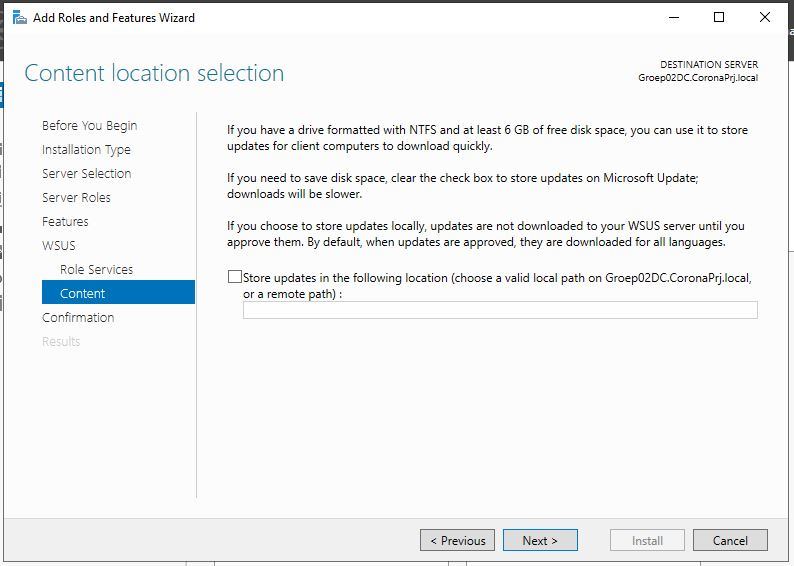
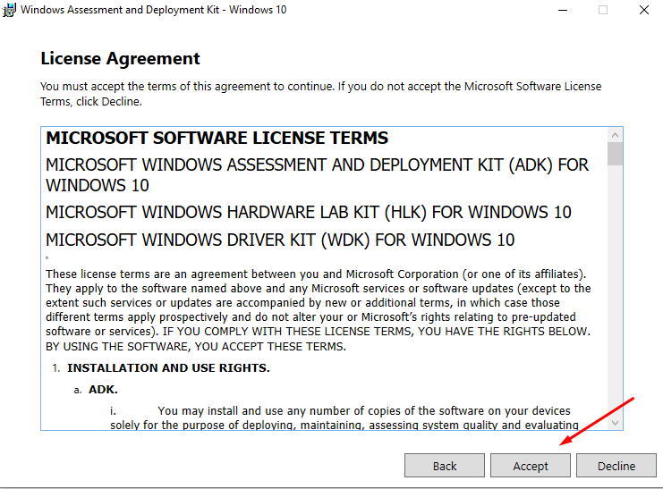

# Member Server

## Inhoud
- [Member Server](#member-server)
  - [Inhoud](#inhoud)
  - [1. Opzetten Windows VM](#1-opzetten-windows-vm)
    - [**Installatie Windows VMs en Installatie van de rollen**](#installatie-windows-vms-en-installatie-van-de-rollen)
    - [**Workflow voor het installeren van de virtuele machines:**](#workflow-voor-het-installeren-van-de-virtuele-machines)
  - [2. Installatie AD](#2-installatie-ad)
    - [ADDS](#adds)
  - [3. Installatie WSUS](#3-installatie-wsus)
  - [4. Configuratie WSUS](#4-configuratie-wsus)
    - [4.1. Configuratie WSUS](#41-configuratie-wsus)
    - [4.2 Aanmaken OU's](#42-aanmaken-ous)
    - [4.3 Opzetten Group Policies](#43-opzetten-group-policies)
  - [5. MDT](#5-mdt)
    - [Benodigdheden](#benodigdheden)
    - [Installatie benodigdheden](#installatie-benodigdheden)
      - [ADK](#adk)
      - [MDT](#mdt)
    - [Configuratie](#configuratie)
      - [Benodigdheden](#benodigdheden-1)
      - [Importeren van OS](#importeren-van-os)
      - [Applicaties toevoegen](#applicaties-toevoegen)
    - [Groep02Cly Task Sequence](#groep02cly-task-sequence)
      - [Windows 10 Task Sequence configureren](#windows-10-task-sequence-configureren)
      - [Windows 2019 Task Sequence configureren](#windows-2019-task-sequence-configureren)
    - [WDS](#wds)
      - [Installatie](#installatie)
      - [Configuratie](#configuratie-1)
    - [Client deployen](#client-deployen)


## 1. Opzetten Windows VM
### **Installatie Windows VMs en Installatie van de rollen**
De aanmaak van verschillende virtuele machines doen we nog handmatig. We maken 2 verschillende machines aan, 1 voor de domeincontroller en een die dient als member server.

Als specificaties voor de VM's gebruiken we 2 CPU cores en 3GB ram. Je mag natuurlijk altijd meer nemen als dit, afhankelijk van je fysieke PC. Ook wordt er een vHDD aangemaakt van minimum 25GB.

**Member server: <br>**
De enige netwerkadapter is `Internal Network` adapter. Geef als naam `winnet` mee.

Om windows server te installeren op de 2 servers maken we gebruik van deze Windows Server ISO: <br>
https://hogent-my.sharepoint.com/:u:/g/personal/vic_rottiers_student_hogent_be/ESBZSoXB_q9DhlVAh-rsSRwBHJ18-1YVmZS50JmcLOW1Qg?e=7gx406 <br>
### **Workflow voor het installeren van de virtuele machines:**
1. Maak vm aan aan de hand van de specificaties
2. Installeer windows server aan de hand van de ISO
3. Installeer virtual box guest additions (bij Devices, 'Insert Guest Additions', voer dit vervolgens uit in verkenner voor de installatie te starten)
4. Voer windows updates uit
5. Voer het script initial-setup.ps1 uit, dit staat in de scripts map (check vooral eerst de settings.json file, hierin staan alle gegevens die worden gebruikt om de basis instellingen te configureren)


## 2. Installatie AD

Alvorens ADDS te installeren, is het nodig om de Member server in het domein van CoronaPrj.local toe te voegen
Klik op Local server in de Server Manager, en vervolgens op de WORKGROUP klikken.

Daar kies je voor Domein, en vul je CoronaPrj.local -> Geef je inloggegevens in de popup in.

### ADDS
- In de Server manager, klik in het dashboard op 'Add roles and features. <br>
Klik vervolgens 3 keer op next -> vink `Active Directory Domain Services` aan. klik vervolgens op `Add Features` als er een popup verschijnt.

- Klik vervolgens nog 3 keer op next -> `Install`

- Na de installatie kan je op `close` klikken.

- Klik vervolgens in de server manager op het vlagje en op `Promote this server to a domain controller`:<br>


- Vink de `Add a domain controller to an existing domain` optie aan. -> Het juiste domein is normaal gezien ingevuld.

- Controleer of DNS server en Global Catalog is aangevinkt.
- Geeft het DSRM wachtwoord in dat je bij Domeincontroller hebt gebruikt.
- Replicatie gebeurt 'Any Domain Controller'
- 2x op Next -> Install

- Normaal gezien start de server nu automatisch opnieuw op. Indien niet start je hem handmatig opnieuw op.

## 3. Installatie WSUS
1. Open de **Server Manager** en klik op `Manage` > `Add Roles and Features`.
2. Klik 3 maal op `Next` tot gevraagd wordt de geweste rollen aan te vinken.
3. Vink `Windows Server Update Services` aan.


4. Er verschijnt een pop-up, klik op `Add Features`.
5. Klik 4 maal op `Next` tot gevraagd wordt een locatie op te geven voor het opslaan van updates.
6. Vink *"Store updates in the following location afzetten"* uit en klik op `Next`.



7. Klik op `Install`. (dit duurt even)
8. Wanneer het proces klaar is, klik op `Close`


## 4. Configuratie WSUS
### 4.1. Configuratie WSUS
1. Open de **Server Manager** en klik op `Tools` > `Windows Server Update Service`.
2. Er verschijnt een pop-up, klik op `Run`. (dit duurt even)


3. Wanneer het proces klaar is, klik op `Close`.
4. Open opnieuw de **Server Manager** en klik op `Tools` > `Windows Server Update Service`.
5. Klik 1 maal op `Next` en vink vervolgens de checkbox uit.
6. Klik 3 maal op `Next` tot gevraagd wordt te verbinden met de Upstream Server.


7. Klik op `Start Connecting`. (dit duurt even)
8. Wanneer het proces klaar is, klik op `Next`.
9. Vervolgens wordt gevraagd de gewenste producten aan te vinken. Vink de categorie **Windows** uit en vink hierbinnen **Windows 10** en **Windows Server 2019** aan.
10. Klik 3 maal op `Next` en vink *"Begin initial synchronization"* aan.
11. Klik op `Next` en dan op `Finish`.

11. De WSUS console verschijnt nu.
12. Klik op `Update Services` > `GROEP02AUT` > `Opties` en daarna op Computers.
12. Er verschijnt een pop-up, vink *"Use Group Policy or registry settings on computers"* aan en klik op `Apply` en dan `Ok`.


13. Navigeer binnen de hiërarchie naar *"All Computers"* en maak 2 nieuwe computer groups **Clients** en **Servers** aan. (Rechtsklikken All Computers > Add Computer Group...)


### 4.2 Aanmaken OU's
1. Open de **Server Manager** en klik op `Tools` > `Active Directory Users and Computers`.
2. Maak binnen het domein **CoronaPrj.local** een OU **domain**. (Rechtsklikken CoronaPrj.local > New > Organisational Unit)
3. Maak binnen **domain** 2 sub-OU's **Clients** en **Servers** aan.


### 4.3 Opzetten Group Policies
1. Open de **Server Manager** en klik op `Tools` > `Group Policy Management`.
2. Navigeer binnen de hiërarchie naar de OU **domain** en maak voor de OU **Clients** een nieuwe GPO aan. (Rechtsklikken > Create a GPO in this domain, and Link it here...)
3. Open de GPO. (Rechtsklikken > Edit)
4. Navigeer binnen de hiërarchie naar `Computer Configuration` > `Administrative Templates` > `Windows Components` > `Windows Update`.
5. Open de setting **Configure Automatic Updates**.
6. Enable de setting, klik op `Apply` en `Ok`.


7. Open de setting **Specify intranet Microsoft update service location**.
8. Enable de setting, geef bij de 2 bovenste opties 2 maal **http://Groep02Aut.CoronaPrj.local:8530** in en klik op `Apply` en `Ok`


9. Open de setting **Enable client-side targeting**.
10. Enable de setting, geef als target group **Clients** in en klik op `Apply` en `Ok`


11. Navigeer binnen de hiërarchie naar `Computer Configuration` > `Administrative Templates` > `System` > `Locale Services`.
12. Open de setting **Restric user locales**.
13. Enable de setting, geef als locales **en-US;nl-BE** in en klik op `Apply` en `Ok`


14. Herhaal deze stappen voor de OU **Servers**, maar vervang hierbij de target group door **Servers** en de locales door **en-US**.

## 5. MDT

### Benodigdheden
1. Microsoft ADK(https://docs.microsoft.com/en-us/windows-hardware/get-started/adk-install)
2. Microsoft Deployment Toolkit(https://www.microsoft.com/en-us/download/details.aspx?id=54259)

### Installatie benodigdheden

#### ADK
1. Download ADK 1903 en de PE add-on  
  

2. Doorloop de installatiestappen  
  
  
  
  

3. Doorloop dan de installatiestappen voor de PE add-on  
  
  
  
  

#### MDT

1. Doorloop de installatiestappen  
  
  
  
  
  
  

### Configuratie

#### Benodigdheden

* Je hebt een iso nodig van windows 10. Deze kan je maken via [Windows Media Creation Tool](https://www.microsoft.com/nl-nl/software-download/windows10).
* Adobe Reader: [klik hier](https://get.adobe.com/nl/reader/enterprise/)
* Java: [klik hier](https://www.java.com/en/download/windows_manual.jsp?locale=en)
* LibreOffice: [klik hier](https://www.libreoffice.org/download/download/)

Maak op de member server onder documenten 3 mappen aan:
1. Adobe Reader
2. Java
3. LibreOffice

Plaats de installatie bestanden van Adobe Reader, Java en LibreOffice in de overeenkomstige map die je net hebt aangemaakt.

####  Importeren van OS

1. Mount de iso die je verkregen hebt met de ***Windows media creation tool*** op de vm.
2. Open de **Deployment Workbench**. 
3. ga links *Deployment shares* --> *MDT deployment Share*. Rechtermuisklik op *Operating systems* en kies *New Folder*.
5. Doorloop de wizard en geef de map een gepaste naam (Bij voorkeur de naam van het besturingssysteem dat je gaat importeren)
5. Ga links *Deployment shares* --> *MDT deployment Share*. Rechtermuisklik op *Operating systems* en kies *import new operating system*.
6. Klik op next en selecteer windows 10 disk image.
7. Doorloop de wizard en klik daarna op finish.

#### Applicaties toevoegen
1. In de *Deployment shares* --> *MDT deployment Share*. Rechtermuisklik op *Applications* en kies *new Folder*.
2. doorloop de wizard en noem de folder ***Client***
3. rechter muisklik op de folder die je juist aangemaakt hebt --> *New application*
4. **Application with source files** --> next
5. Naam: AdobeReader --> Next
6. selecteer de map **AdobeReader** in documenten --> next
7. next
8. Command Line: **AcroRdrDC1900820071_nl_NL.exe /sAll**
9. Doorloop de wizard tot hij sluit.

Doe nu stap 3 tot 9 opnieuw voor: 
* Java
  * Naam: **Java**
  * Command Line: **jre-8u281-windows-x64.exe /s**
* LibreOffice
  * Naam: **LibreOffice**
  * Command Line: **msiexec /i LibreOffice_7.1.1_Win_x64.msi /qn**

> LET OP: **jre-8u281-windows-x64.exe** is de naam van het installatiebestand. Kijk na of dit overeen komt de installatiebestanden die je hebt gedownload

### Groep02Cly Task Sequence

#### Windows 10 Task Sequence configureren

1. In de *Deployment shares* --> *MDT deployment Share*. Rechtermuisklik op *Task Sequences* en kies *new task sequence*.
2. ID: ***Win10ProApps***, Naam: ***Windows 10 pro met applicaties*** en Beschrijving: ***Windows 10 pro met volgende applicaties: Adobe Reader, Java jre, LibreOffice***. 
3. Kies als template ***Standard client task sequence***.
4. Kies als OS ***Windows 10 pro in windows 10 home***.
5. Kies ***Do not specify a key at this time***.
6. Naam: ***Gebruiker***, Organisatie: ***CoronaPrj*** en home page laat je standaard.
7. Do not specify a Administrator password.
8. Open de properties van de task sequence die je juist aangemaakt hebt en ga naar tabladd Task sequence. (rechtermuisklik --> Properties)
9.  Onder initialization klik op ***gather local only*** en zet de checkbox op ***gather local data and process rules***. De Rules file is: ***customsettings.ini***.
10. Onder state restore klik op ***install applications*** en onder options vink de ***disable this step*** optie aan.
11. Maak onder de uitgeschakelde ***install applications*** een nieuwe groep (*add*--> *new group*). Naam : **install apps**
12. Klik op apply en op ok.

13. Selecteer de groep die je hebt aangemaakt. Klik dan vanboven op *add* --> *general* --> *install application*.
14. Vink install a *single application* aan. Klik dan op *browse* en selecteer *Client* --> *AdobeReader*.
15. geef deze opdracht de naam **Install AdobeReader**. 
16. Herhaal stap 13 tot en met 15 voor:
    1.  Java
    2.  LibreOffice
17. Klik op apply en ok.
18. Klik met je rechtermuisknop op MDT deployment share (C:...) en open de properties.
19. Ga naar tablad *rules* en klik ***edit bootstrap.ini***.
20. Hier kan je volgende lijnen kopiëren:
```
[Settings]
Priority=Default

[Default]
DeployRoot=\\GROEP02AUT\DeploymentShare$
UserDomain=CoronaPrj.local
UserID=Administrator
UserPassword=Admin123
SkipBDDWelcome=YES

```

1.  Sla op en sluit het venster.
2.  Bij de Rules kopieer je onderstaande lijnen:
```
[Settings]
Priority=Default, SetOSD
Properties=OSDPrefix

[Default]
_SMSTSORGNAME=Deployment Share
_SMSTSPackageName=%TaskSequenceName%


SkipComputerName=NO

OSInstall=YES
AdminPassword=Admin123
SkipCapture=YES
SkipAdminPassword=YES
SkipProductKey=YES
SkipComputerBackup=YES
SkipBitLocker=YES

TimeZoneName=CET Standard Time
UILanguage=en-GB
UserLocale=en-GB
KeyboardLocale=fr-BE
BitsPerPel=32
VRefresh=60
XResolution=1
YResolution=1
HideShell=YES

JoinDomain=CoronaPrj.local
DomainAdmin=Administrator@CoronaPrj.local
DomainAdminDomain=CoronaPrj.local
DomainAdminPassword=Admin123

SkipUserData=YES
SkipLocaleSelection=YES
SkipDomainMembership=YES
SkipTimeZone=YES
SkipSummary=YES
SkipFinalSummary=YES
SkipRoles=YES
FinishAction=SHUTDOWN
WSUSServer=http://Groep02Aut.CoronaPrj.local:8530
EventService=http://Groep02Aut:9800

```

3.  Klik op apply en ok.
4.  Klik met je rechtermuisknop op MDT deployment share (C:...) en open ***Update deployment share***.
5.  Kies voor: ***completely regenerate the boot images*** en klik op next. *Dit kan even duren*. 
6.  Klik finish.

#### Windows 2019 Task Sequence configureren

> Eerst ga je een iso van windows server 2019 nodig hebben. Als je deze hebk verkregen ga je terug het OS moeten importeren in de *Deployment Workbench*. Hiervoor kan je gebruik maken van de stappen die beschreven staan in [Importeren van OS](#importeren-van-os)

1. In de *Deployment shares* --> *MDT deployment Share*. Rechtermuisklik op *Task Sequences* en kies *new task sequence*.
2. ID: ***Win19DHCP***, Naam: ***Windows 2019 DHCP Server*** en Beschrijving: ***Windows 2019 met DHCP rol geïnstalleerd***. 
3. Kies als template ***Standard client task sequence***.
4. Kies als OS ***Windows 2019 SERVERSTANDARD in Windows Server 2019 SERVERSTANDARDCORE***.
5. Kies ***Do not specify a key at this time***.
6. Naam: ***Gebruiker***, Organisatie: ***CoronaPrj*** en home page laat je standaard.
7. Do not specify a Administrator password.
8. Open de properties van de task sequence die je juist aangemaakt hebt en ga naar tabladd Task sequence. (rechtermuisklik --> Properties)
9.  Onder initialization klik op ***gather local only*** en zet de checkbox op ***gather local data and process rules***. De Rules file is: ***customsettings.ini***.
10. Onder state restore klik op ***install applications*** en onder options vink de ***disable this step*** optie aan.
11. Maak onder de uitgeschakelde ***install applications*** een nieuwe groep (*add* --> *new group*). Naam : **install roles**
12. Binnen de groep **install roles**, die je net hebt aangemaakt, *add* --> *Roles* --> *Install Roles and Features*
13. In het rechterscherm, zet de dropdown op *Windows Server 2019*
14. In het venster daaronder kies je de rollen die je wil installeren. In ons geval is dit **DHCP**
15. Klik op apply en op ok.


> Als je nog Tasksequences wil aanmaken kan je de 1 tot 19 opnieuw doorlopen. Maak ook een tasksequence aan voor een **clean install** van Windows Server 2019, Hiervoor moet je stap 11 tot 14 niet uitvoeren.

### WDS

Met WDS kunnen we PXE-boot beschikbaar maken op het netwerk.

#### Installatie

Installeer de DNS rol via:

*Server Manager -> Dashboard -> Quick Start -> (2) add roles and features*

1. Selecteer de ***Windows Deployment Service*** rol;
2. Klik op Add Features;
3. Bij **Role Services** moeten *deployment server* en *transport server* beide aangevinkt zijn
4. Klik op next en install;

#### Configuratie

1. *Tools* --> *Windows deployment services*
2. *Servers* --> *Groep02Aut.CoronaPrj.local*
3. Rechtermuisklik op deze server en kies **configure server**
4. Klik op next en kies **Integrated with active directory** --> next.
5. *respond to all client computers* selecteren --> next en finish.
6. Rechtermuisklik op *boot images* --> *add boot image*.
7. *browse* --> navigeer naar ***C:\\DeploymentShare\boot***. Selecteer *LiteTouchPE_x64.wim*
8. Next.
9. Next.
10. Rechtermuisklik op de *Groep02Aut.CoronaPrj.local* en kies voor properties. 
11. Tabblad *TFTP* --> er mag geen vinkje staan bij *enable variable window extension*, *maximum block size*: 1024. 
12. klik op apply en ok.
13. Rechtermuisklik op de *Groep02Aut.CoronaPrj.local* --> *all tasks* --> *start* of *restart*.

### Client deployen
1. Maak een niewe VM
2. *Instellingen* --> *Systeem* 
3. Stel onderstaande opstartvolgorde in:
  - [x] Harde Schijf
  - [X] Netwerk
  - [ ] Diskette
  - [ ] Optisch
4.  Start de VM op en houd de terminal *nauwlettend* in het oog.
5.  Wacht tot je iets gelijkaardigs ziet als ***Press F12 for PXE-boot***
6.  Druk `F12` 
7.  Kies vervolgens de gewenste task sequence (valt te zien welk systeem je wil deployen) en klik op next.
8.  De client wordt nu automatisch geïnstalleerd.
