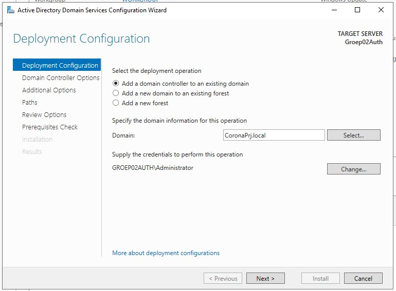

# Technische Documentatie

## Installatie Windows VMs en Installatie van de rollen
De aanmaak van verschillende virtuele machines doen we nog handmatig. We maken 2 verschillende machines aan, 1 voor de domeincontroller en een die dient als member server.

Als specificaties voor de VM's gebruiken we 2 CPU cores en 3GB ram. Je mag natuurlijk altijd meer nemen als dit, afhankelijk van je fysieke PC. Ook wordt er een vHDD aangemaakt van minimum 25GB.

**Domeincontroller:  **
**De 1ste netwerkadapter is een NAT adapter, de 2de adapter is een host-only.** 
**Member server:  **
**De netwerkadapter is host-only.**

Om windows server te installeren op de 2 servers maken we gebruik van deze Windows Server ISO:  
https://hogent-my.sharepoint.com/:u:/g/personal/vic_rottiers_student_hogent_be/ESBZSoXB_q9DhlVAh-rsSRwBHJ18-1YVmZS50JmcLOW1Qg?e=7gx406  

### Workflow voor het installeren van de virtuele machines:
1. Maak vm aan
2. Installeer windows server aan de hand van de ISO
3. Installeer virtual box guest additions (bij Devices, 'Insert Guest Additions', voer dit vervolgens uit in verkenner voor de installatie te starten)
4. Voer windows updates uit

Vervolgens worden er volgende scriptjes uitgevoerd voor de verdere installatie en configuratie van de Domeincontroller en member server:  
**Voor het uitvoeren van het `initial-setup.ps1` script moet je in de settings.json eerst nog dingen aanpassen als je dit wenst. Bepaalde settings en namen bijvoorbeeld.**  

**Domeincontroller**:
  1. Run het `initial-setup.ps1` script
  1. ADDS -> `install_ADDS.ps1`
  2. DNS -> `install_DNS.ps1`
  3. DHCP -> `install_dhcp.ps1`
  4. WSUS -> `install_WSUS.ps1`

**Member server**:
  1. Run het `initial-setup.ps1` script
  2. Ga naar de server manager en installeer de rol ADDS, via de link `Add roles and features`
     1. klik door de setup door tot je aan Server Roles komt, klik daar `Active Directory Domain Services` aan.
     2. Als er een popup is met extra features add je die ook. 
     3. Dan klik je bij de confirmation op ok en worden de roles geïnstalleerd. 
     4. klik vervolgens op promote to domaincontroller  
     
     5. In het scherm maak je de opstelling na zoals in de screenshot hieronder  
     
     6. vervolgens kun je bij Domain Controller Options kiezen om te repliceren van DC
  3. WSUS -> aanvulling Maurits
  4. MDT -> aanvulling Ruby

### Uitleg over de scripts:

- **initial-setup.ps1**  
Het `initial-setup.ps1` script zet alle basisinstellingen zoals servernaam, netwerkadapters en windows update.  Ook zet dit script het wachtwoord op 'Never Expires' 
- **install_ADDS.ps1**  
Het `install_ADDS.ps1` script kijkt eerst of het script op de member server of op de dc wordt uitgevoerd, vervolgens gaat het de ADDS rol installeren als dit nodig is. Vervolgens gaat hij kijken de server een nieuw forest moet aanmaken of een domeincontroller moet toevoegen om van te repliceren.
vervolgens restart het script de server, waarna de changes zijn doorgevoerd.
- **install_DNS.ps1**  
Het `install_DNS.ps1` script installeert de DNS rol indien die nog niet geinstalleerd moest zijn, en gaat vervolgens nog een reverse lookup zone aanmaken.
- **install_dhcp.ps1**  
Het `install_dhcp.ps1` script gaat de DHCP rol installeren als dit nog nodig is, en gaat vervolgens gaan configureren. Eerst wordt de DHCP server in het domein toegevoegd.
Er wordt daarna een scope aangemaakt met parameters uit de settings.json file, en daarna authorized het script de DHCP server.
- **install_WSUS.ps1**  
Een heel simpel script. Hierin wordt de WSUS server rol geïnstalleerd. `Aanvulling voor Maurits?` 
