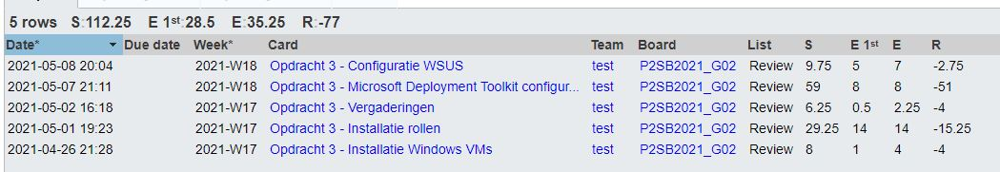

# Lastenboek Opdracht 3: MDT

## Deliverables
- Demo tijdens de contactmomenten van de proof-of-concept
    - Automatische installatie Windows Server en Windows 10
- Op Github:
    - Lastenboek
    - Alle achtergrondinformatie die jullie verzameld hebben om met de opdracht aan de slag te kunnen gaan
    - Gedetailleerde technische handleidingen gericht naar andere teamleden over installatieprocedures en de gebruikte scripts
    - Testplannen en testrapporten

## Deeltaken

1. **Installatie Windows VMs**
    - Verantwoordelijke: Pieter Van Keer, Vic Rottiers
    - Tester: Pieter Van Keer
2. **Installatie Rollen**
    - Verantwoordelijke: Pieter Van Keer, Vic Rottiers
    - Tester: Pieter Van Keer
3. **WSUS Windows Server Update Services**
    - Verantwoordelijke: Maurits Monteyne
    - Tester: Pieter Van Keer
4. **Microsoft Deployement Toolkit**
    - Verantwoordelijke: Ruby Verhoye
    - Tester: Vic Rottiers

## Demofilmpje:
https://hogent-my.sharepoint.com/:v:/g/personal/vic_rottiers_student_hogent_be/EQq2xfh6KuNIu4wv5R3d0CABvRrdK9l_eYBSjvraTdgXGA?e=epnR7s 

## Tijdbesteding

| Student          | Geschat | Gerealiseerd |
| :--------------- | ------: | -----------: |
| Pieter Van Keer  |      10 |        47.25 |
| Ruby Verhoye     |       8 |           35 |
| Vic Rottiers     |     8.5 |         21.5 |
| Maurits Monteyne |       7 |            8 |
| **totaal**       |    45,5 |         96,5 |

