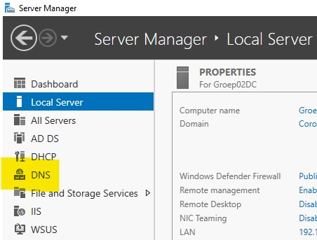

# Testplan Opdracht 3: Microsoft Deployment Toolkit

## De testplannen zijn opgesteld op basis van de scripts die gebruikt worden bij de installatie (zie technische documentatie)

# Testplan taak 1: Initial setup
Auteur(s) testplan: Vic Rottiers

1. Start de server op
2. Voer het initial setup script uit zoals uitgelegd in de technische documentatie.
3. Check volgende zaken in de `Local server` tab in de Server Manager.
   1. Computer Name: `Groep02DC` of `Groep02Aut`
   2. Netwerk adapters: 
      - `LAN` adapter die een ip 192.168.1.x heeft
      - `WAN` adapter, die door dhcp een ip krijgt (enkel bij DC, dus met computernaam `Groep02DC`)

# Testplan taak 2: installatie ADDS
Auteur(s) testplan: Vic Rottiers
1. Start de server op
2. Voer het initial setup script uit zoals uitgelegd in de technische documentatie, en vervolgens ook het ADDS script.
3. Check volgende zaken in de Server manager:
   1. Links in de kolom zou er een tab 'AD DS' moeten zijn. 
   
4. Vervolgens ga je naar 'Tools' en kies je voor Active Directory Sites and Services
   1. Vergelijk het venster met de screenshot hieronder, dit moet normaal gezien hetzelfde zijn.
    

# Testplan taak 3: installatie DNS
Auteur(s) testplan: Vic Rottiers

1. Start de server op
2. Voer de vorige 2 scripts uit aan de hand van de technische documentatie, voer daarna het DNS script uit.
3. kijk in de server manager of er in de linkse kolom een tabblad DNS is bijgekomen.  

4. Vervolgens ga je naar 'Tools' en klik je op 'DNS' in de lijst
5. dubbelklik op de naam van de server in de lijst, en klik vervolgens op 'Reverse Lookup Zones' 
   Het scherm moet hetzelfde zijn als deze screenshot:
   

# Testplan taak 4: installatie DHCP
Auteur(s) testplan: Vic Rottiers

1. Start de server op
2. Voer de vorige 3 scripts uit aan de hand van de technische documentatie, voer daarna het DHCP script uit.
3. kijk in de server manager of er in de linkse kolom een tabblad DHCP is bijgekomen.  

4. Vergelijk onderstaande screenshot met de DHCP msc (die je kan bekijken via 'Tools' en vervolgens 'DHCP'), dit zou overeen moeten komen.  
Het is mogelijk dat deze instellingen anders kunnen zijn, in dat geval bekijk je in de scripts folder de `settings.json` file en vergelijk je de waarden daarmee. Hier zouden ze sowieso mee moeten overeen komen.  

5. als laatste verifieer je of de DHCP server geauthoriseerd is.   Dit doe je door rechtermuisklik op groep02dc.coronaprj.local te doen. Als er 'Unauthorize' staat is de server correct geconfigureerd.

# Testplan taak 5: WSUS configuratie
Auteur(s) testplan: Maurits Monteyne

## Member Server
Dit deel moet uitgevoerd worden op de Member server.

1. Open de **Server Manager** via het Start menu en klik daarna op `Tools` > `Windows Server Update Service`.
2. Navigeer binnen de hiërarchie (links) naar `Update Services` > `GROUP02AUT` > `All Computers` en klap dit open.
3. Controleer dat hier buiten `Unassigned Computer` nog twee categoriën bestaan: `Clients` en `Servers`.
4. Klik op categorie `Clients`. Zet bovenaan de status op `Any` en druk op `Refresh`.
5. Controleer dat in de lijst een client verschijnt met de naam `Groep02Cly`waarbij de y een getal voorstelt.
6. Klik op categorie `Servers`. Zet bovenaan de status op `Any` en druk op `Refresh`.
7. Controleer dat in de lijst een server verschijnt met de naam `Groep02Cly`waarbij de y een getal voorstelt.

## Client en Server
Dit deel moet uitgevoerd worden op de Windows Client en de Windows Server.

1. Open de **Registry Editor** via het Start menu.
2. Navigeer binnen de hiërarchie (links) naar `Computer` > `HKEY_LOCAL_MACHINE` > `SOFTWARE` > `Policies` > `Microsoft` > `Windows` > `WindowsUpdate`.
3. Klik op `WindowsUpdate`, rechts verschijnt een lijst.
4. Controleer dat de `Data` kolom overeenkomt met onderstaande afbeelding. 

(Deze afbeelding hoort bij de **Windows Client**. Het enige verschil met de **Windows Server** is de waarde bij `TargetGroup`, die wordt daar `Servers` i.p.v. `Clients`).

5. Navigeer binnen de hiërarchie (links) naar `Computer` > `HKEY_LOCAL_MACHINE` > `SOFTWARE` > `Policies` > `Microsoft` > `Control Panel` > `International`.
6. Klik op `International`, rechts verschijnt een lijst.
7. Controleer dat de `Data` kolom overeenkomt met onderstaande afbeelding. 

(Deze afbeelding hoort bij de **Windows Client**. Het enige verschil met de **Windows Server** is de waarde bij `AllowableUserLocaleTagList`, die wordt daar `en-US` i.p.v. `en-US;nl-BE`).

# Testplan taak 6: MDT

## Besturingssystemen nakijken
1. Start de server op.
2. Volg de technische documentatie om dezelfde configuratie op te zetten.
3. Open de deployment workbench (*windows toets* --> typ: *deployment workbench* --> enter)
4. Kijk onder het tablad *Operating systems* --> *Windows 10*
5. Dit moet er als volgt uit zien:
   [voorbeeld van de lijst met besturingssystemen](testimg/MDT-OS.JPG)
6. Doe het zelfde in de map *Windows server 2019*:
   [voorbeeld van de lijst met besturingssystemen](testimg/MDT-OS2.JPG)

## Task sequences nakijken
1. Navigeer in de deployment workbench
2. Hier vind je al de task sequences die je hebt aangemaakt. (Het resultaat in de screenshot kan dus varieren)
   [voorbeeld van de lijst met task sequences](testimg/MDT-TaskSeq.JPG)

## client deployen
1. deploy adhv de technische documentatie een windows 10 pro client met applicaties: 
- adobe reader
- libre office
- java

2. als de deployment afgelopen is start je de vm op.
3. Controleer of de client in het domein ***CoronaPrj*** zit. 
4. Controleer dat de applicaties geïnstalleerd zijn (Adobe reader, libre office, java)