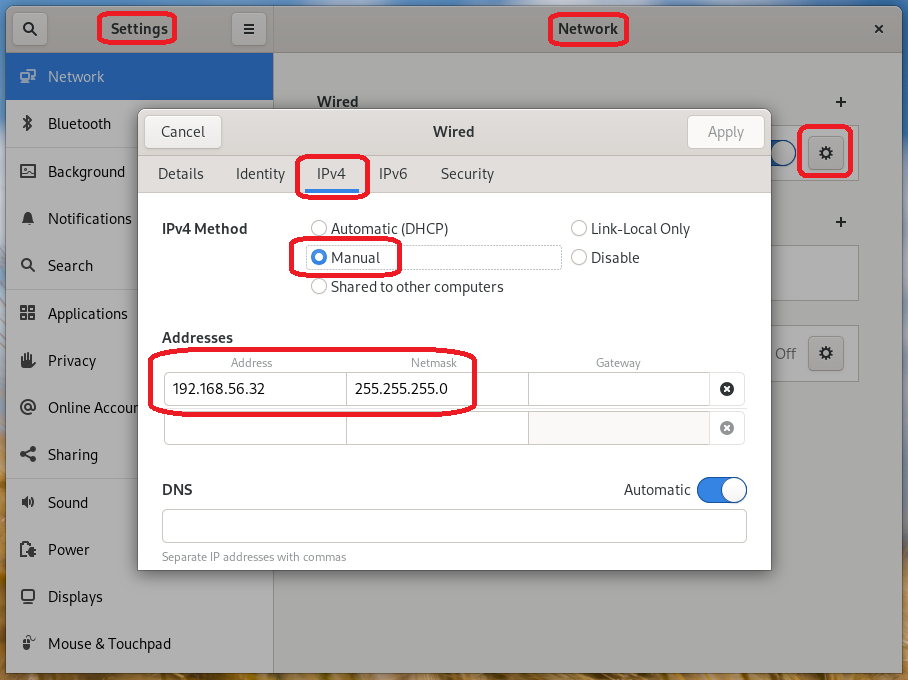
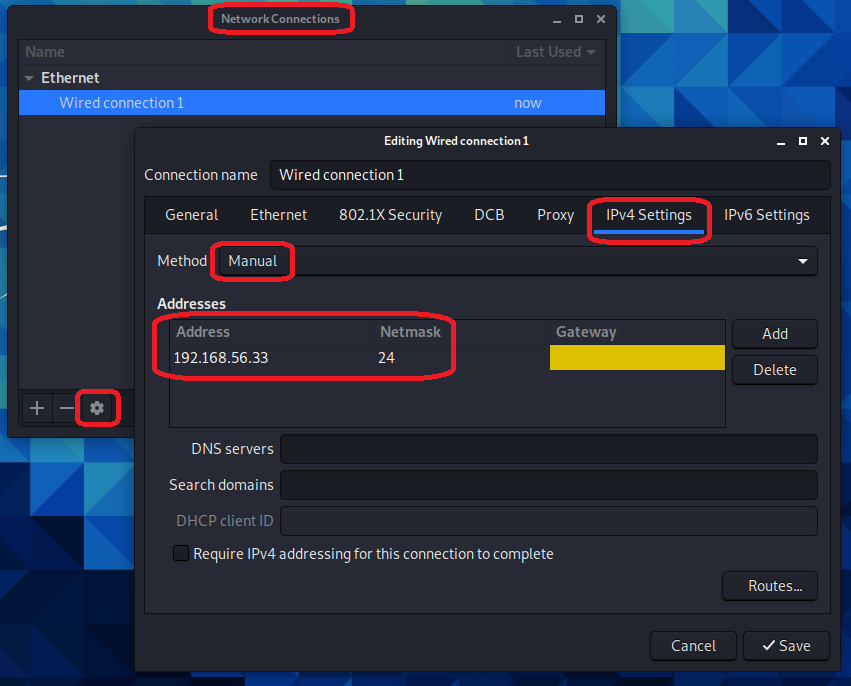
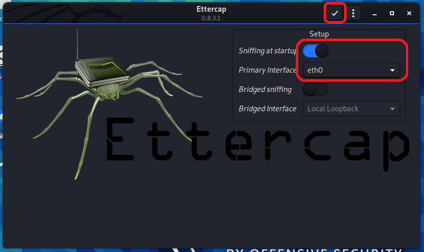
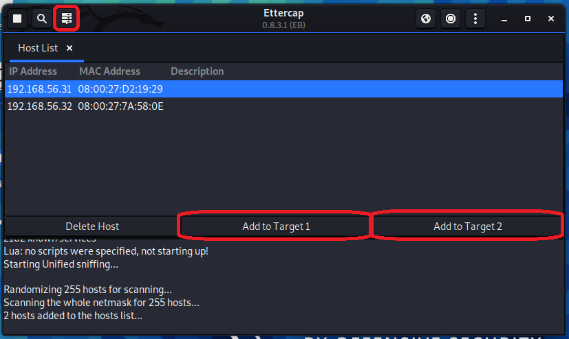
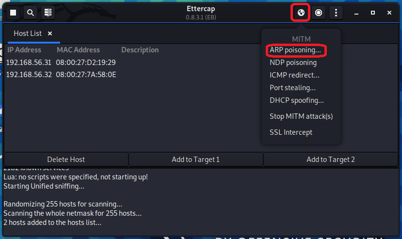
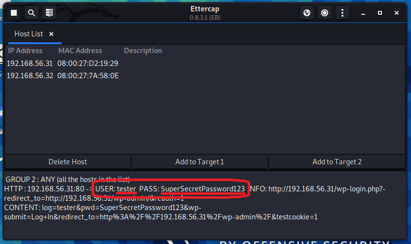

# Demo cybersecurity attack

## Inhoud
- [1. Opzetten virtuele testomgeving](#1-Opzetten-virtuele-testomgeving)
    - [1.1 Webserver VM](#1.1-Webserver-VM)
    - [1.2 Fedora VM](#1.2-Fedora-VM)
    - [1.3 Kali Linux VM](#1.3-Kali-Linux-VM)
- [2. Uitvoeren cybersecurity attack](#2-Uitvoeren-cybersecurity-attack)


Link naar testomgeving: https://hogent-my.sharepoint.com/:u:/g/personal/maurits_monteyne_student_hogent_be/EcpT-t5xtHxLvgrdW71r4BYBvqfhO8s-Btx7OVCmZvZ1eA?e=aSP2Gs

| Computer  | Gebruikersnaam| Wachtwoord |
| :-------- | :------------ | :--------- | 
| Webserver VM | vagrant | vagrant |
| Fedora VM | maurits | toor |
| Kali Linux VM | maurits | toor |

## 1. Opzetten virtuele testomgeving
| Computer | OS | IP-adres| Netwerkadapter |
| :------- | :- | :---------| :------------- | 
| Webserver VM | zie opdracht 2 | 192.168.56.31 | Intern netwerk ("Tnet") |
| Fedora VM | Fedora 32 Workstation | 192.168.56.32 | Intern netwerk ("Tnet") |
| Kali Linux VM | Kali Linux 2020.4 | 192.168.56.33 | Intern netwerk ("Tnet") |

### 1.1 Webserver VM
1. Maak een VM aan gebaseerd op de webserver uit opdracht 2 en configureer ook de Wordpress blog.
2. Schakel na het installeren van de webserver alle netwerkadapters van de VM uit.
3. Geef de VM één netwerkadapter die aangesloten is op het intern netwerk "Tnet".
4. Start de VM op en open het bestand `/etc/sysconfig/network-scripts/ifcfg-eth0`.
5. Zet de bestaande configuratie in commentaar.
6. Zet onderstaande configuratie in het bestand en sla het bestand op.
    ```bash
    # Static IP Address #
    BOOTPROTO=none
    # Server IP #
    IPADDR=192.168.2.10
    # Netmask #
    NETMASK=255.255.255.0
    # Default Gateway IP #
    GATEWAY=192.168.1.1
    # Device Name #
    DEVICE=eth0
    # Activate on Boot #
    ONBOOT=yes
    ```
7. Herstart de network service met het commando `systemctl restart network`. (Indien dit een error geeft, kan de VM ook opnieuw opgestart worden.)
8. Open het bestand `/var/www/html/wp-config.php`.
9. Zoek de lijn met `define( 'WP_DEBUG', false );`, plaats daaronder de volgende 2 lijnen en sla het bestand op.
    ```php
    define( 'FORCE_SSL', false );
    define( 'FORCE_SSL_ADMIN', false );
    ```
10. Herstart de webserver met het commando `systemctl restart httpd`.

### 1.2 Fedora VM
1. Maak een VM aan met Fedora 32 Workstation. (Gebruik overal de standaard instellingen)
2. Geef de VM één netwerkadapter die aangesloten is op het intern netwerk "Tnet".
3. Geef de VM het statisch IP-adres 192.168.56.32 met het subnet mask 255.255.255.0.
    - Ga hiervoor naar `Setting > Network` en klik op het tandwiel. Klik daarna op de tab `IPv4`, zet de methode op `Manual` en vul bovenstaande gegevens in.



### 1.3 Kali Linux VM
1. Maak een VM aan met Kali Linux 2020.4. (Gebruik overal de standaard instellingen)
2. Geef de VM één netwerkadapter die aangesloten is op het intern netwerk "Tnet".
3. Geef de VM het statisch IP-adres 192.168.56.33 met het subnet mask 255.255.255.0.
    - Ga hiervoor naar `Advanced Network Configuration`, selecteer `Wired connection 1` en klik op het tandwiel. Klik daarna op de tab `IPv4 Settings`, zet de methode op `Manual` en vul bovenstaande gegevens in.




## 2. Uitvoeren cybersecurity attack
#### Op Kali Linux VM
1. Open het programma `Ettercap`. Het systeem zal het wachtwoord van de gebruiker vragen alvorens op te starten.
2. Zorg dat `Sniffing at startup` aan staat en `eth0` geselecteerd staat als `Primary Interface`. Druk daarna op het vinkje bovenaan rechts.



3. Laat Ettercap scannen naar toestellen op het netwerk door bovenaan links op het vergrootglas te klikken.
4. Wanneer dit gedaan is, klik op het icoontje rechts van het **vergrootglas**. Er verschijnt een lijst met toestellen binnen het netwerk.
5. Selecteer het eerste record en klik op `Add to Target 1`. Selecteer daarna het tweede record en klik op `Add to Target 2`.



6. Klik bovenaan rechts op het **aardbol icoontje** en klik op `ARP poisoning...`.



7. Er verschijnt een pop-up. Zorg dat `Sniff remote connections` aangevinkt staat en druk op `OK`

#### Op Fedora VM
1. Open een browser en surf naar `http://192.168.56.31/wp-admin`.
2. Vul de login gegevens voor de Wordpress blog in en druk op `Log in`.

#### Op Kali Linux VM
8. In de Ettercap console verschijnen de login gegevens van de Wordpress blog. Het POST request werd succesvol onderschept.



9. Druk bovenaan links op het **witte vierkant** om de aanval te stoppen.