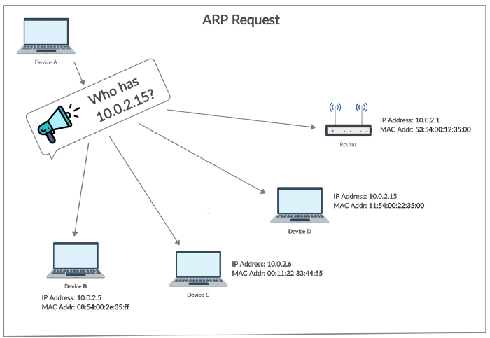
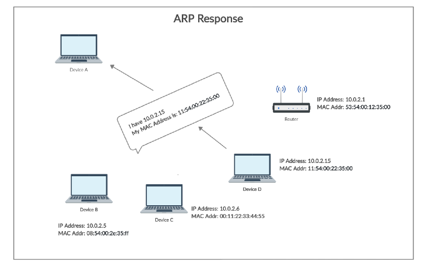
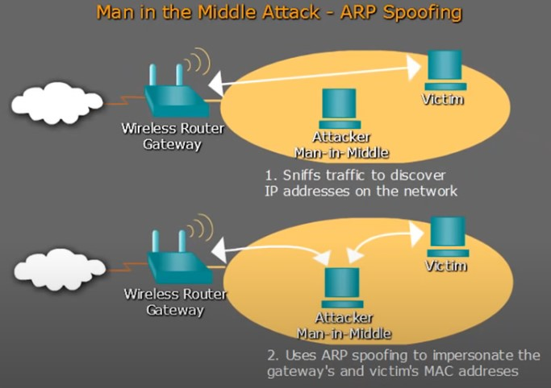

# ARP Spoofing - Een Man In The Middle Attack
## Inhoudstabel
1. [Intro](#1.-intro)
2. [Wat is ARP (Address Resolution Protocol)?](#2.-wat-is-arp-address-resolution-protocol)
3. [Man In The Middle Attack (MITM) - ARP Spoofing](#3.-man-in-the-middle-attack-mitm---arp-spoofing)
4. [Bescherming: Wat kan een bedrijf doen?](#4.-bescherming-wat-kan-een-bedrijf-doen)
    - [1. Statische ARP entries](#1-statische-arp-entries)
    - [2. Detectie en preventie software](#2-detectie-en-preventie-software)
    - [3. OS beveiliging](#3-os-beveiliging)

---

## 1. Intro
In deze White Paper gaan we het concept van ARP spoofing en Man In The Middle (MITM) Attacks toelichten. Onder andere hoe de verschillende concepten in zijn werk gaan, welke delen van het netwerk er vatbaar zijn, en hoe men er zich kan tegen beschermen.

---

## 2. Wat is ARP (Address Resolution Protocol)?

Computer die communiceren via het internet maken gebruik IP-adressen om elkaar te identificeren en data naar het juiste apparaat te sturen. Binnen een LAN of lokaal netwerk wordt daarvoor echter een andere identifier gebruikt, de zogenaamde MAC-adressen (Media Acces Control). Om de overgang van het ene systeem naar het ander probleemloos te doen verlopen, wordt gebruik gemaakt van Address Resolution Protocol of ARP. Dit is een protocol dat toelaat om voor een IP-adres het bijhorend MAC-adres op te vragen. De data voor deze adresomzetting wordt opgeslagen in een ARP tabel en gevuld met behulp van ARP requests. Deze requests zullen voor elke onbekend IP-adres het netwerk afzoeken naar het bijhorend MAC-adres. Door deze data op te slaan in een tabel, is het niet nodig om steeds opnieuw naar het MAC-adres van een bepaald IP-adres te gaan zoeken. 
Een voorbeeld: 

  

bron: https://levelup.gitconnected.com/man-in-the-middle-attack-part-1-arp-spoofing-6f5b174dec59   

 
Als computer A naar computer D data wil versturen, zal het eerst het MAC-adres van deze computer moeten vinden. Indien A dit niet vind in zijn ARP tabel, gaat computer A een broadcast ARP request sturen met de vraag welk apparaat dit bepaald IP adres heeft. (Een broadcast is een bericht dat naar alle toestellen op het netwerk wordt gestuurd.) Het correcte apparaat (D) zal hierop antwoorden met zijn MAC-adres. Computer A zal dit adres nu in zijn ARP tabel opslaan en de data naar dit MAC-adres sturen.

---

## 3. Man In The Middle Attack (MITM) - ARP Spoofing

Een MITM Attack is een aanval waarbij de communicatie tussen twee apparaten wordt omgeleid door een ander toestel zonder dat beide apparten hier iets van weten. Het malafide toestel kan alle inkomende en uitgaande informatie lezen en eventueel ook aanpassen.

Bij ARP Spoofing gaat de aanvaller (de 'Man in the middle') de informatiestroom en het netwerk monitoren om vervolgens het IP-adres van het 'Target' of 'Victim' te bepalen. Eens dit IP-adres is gevonden, kan de aanvaller door middel van ARP Spoofing zichzelf voordoen als een andere apparaat op het netwerk. Dit houdt in dat aanvaller spoofed of vervalste ARP replies stuurt naar zijn target en zo die zijn ARP tabel manipuleert. Dit is mogelijk omdat Het MAC-adres van aanvaller wordt nu gelinkt aan een IP-adres dat helemaal niet van hem is. Hierdoor denkt het target dat het data naar bv. een webserver of router stuurt, maar deze pakketten worden eigenlijk doorgestuurd naar de aanvaller. De aanvaller hoeft nu enkel deze pakketten op zijn beurt door te sturen naar een webserver of router en dan is hij een volwaardig man in the middle.

Nu kan hij op een "onzichtbare" manier alle inkomende en uitgaande data (gebruikersnamen, wachtwoorden etc) van en naar het slachtoffer monitoren en eventueel ook aanpassen om het vervolgens gewoonweg te forwarden van of naar het slachtoffer.

Belangrijk om te vermelden is dat in de realiteit het netwerkverkeer vaak versleuteld is. De aanvaller zal dus ook nog deze encryptie moeten kraken, anders kan de data niet bekeken of aangepast worden.

      
    bron: https://www.youtube.com/watch?v=hI9J_tnNDCc

--- 

## 4. Bescherming: Wat kan een bedrijf doen?
Ter bescherming tegen dit soort aanvallen zijn er enkele stappen die een bedrijf kan ondernemen:

### 1. Statische ARP entries
Een eerste implementatie van beveiliging tegen ARP Spoofing Attacks is het instellen van statische ARP entries in de ARP tabel. Hierbij ga je de ARP entries (IP adres -> MAC adres) van de belangrijkste apparaten binnen het netwerk hardcoderen in de ARP tabel van elk apparaat. Zo kan er niet aan vervalsing gedaan worden omdat er geen ARP Requests meer verstuurd worden voor deze belangrijke toestellen. Zo weet bijvoorbeeld elk apparaat waar de router zich bevindt, en moet niemand hier een ARP request voor rondsturen.

Zoals u wel merkt is deze oplossing geen eenvoudige oplossing voor zeer grote netwerken of netwerken die vaak en snel uitbreiden. De ARP tabellen zouden veel te vaak aangepast moeten worden.

### 2. Detectie en preventie software
Er zijn verschillende technnieken die door software worden gebruikt om in het netwerk te controlleren op ARP Spoofing. Algemeen werken deze technieken met een soort van cross-checking of het gebruik van certificaten voor de ARP responses. Als een response hier niet aan voldoet, wordt dit geblokkeerd. Deze technieken worden vaak geimplementeerd op DHCP servers zodat ze zowel statische als dynamische IP-adressen kunnen controleren. Er bestaan ook meer passieve opties die een notifactie zullen sturen bij het veranderen van een ARP entry in de ARP tabel.

Voorbeelden van dergelijke software zijn AntiARP voor Windows systeme en ArpStar voor Linux en LinkSys systemen. 

### 3. OS beveiliging
Besturingssystemen hebben elk hun eigen manier om te reageren op ongevraagd ARP responses. Zo zullen Linux distributies deze gewoon negeren. Op Windows toestellen kunnen er dan weer tal van regiser entries aangepast worden om het gedrag van de ARP tabel in te stellen.
 
 
Indien u graag een uitgebreide lijst van software wil, kan u die vinden op onderstaande link:  
https://en.wikipedia.org/wiki/ARP_spoofing#Tools 