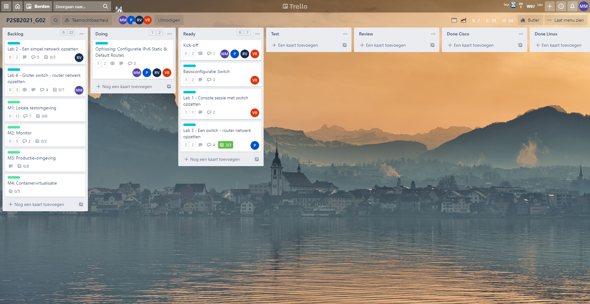
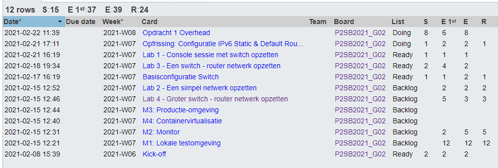
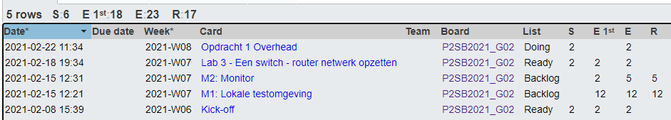
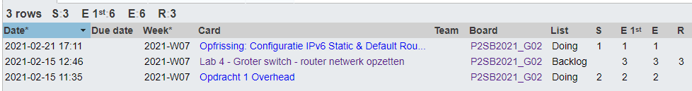
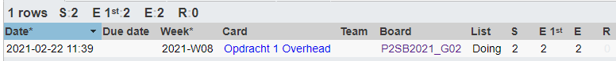
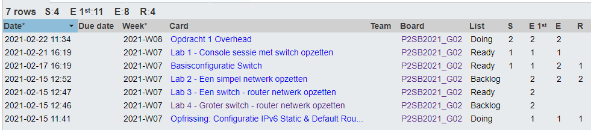

# Voortgangsrapport week 3

* Groep: 02
* Datum voortgangsgesprek: 22/02/2021

| Student          | Aanw. | Opmerking |
| :----------------| :---  | :---      |
| Pieter Van Keer  |  ok   |           |
| Maurits Monteyne |  ok   |           |
| Ruby Verhoye     |  ok   |           |
| Vic Rottiers     |  ok   |           |

## Wat heb je deze week gerealiseerd?

### Algemeen

* Werkverdeling opdracht 1
* Checklists opdracht 2

### Pieter Van Keer

* Lab 3 - Een switch/router netwerk opzetten
* checklist: hoe verwijder je achtergebleven instellingen

### Maurits Monteyne

* Opfrissing: Configuratie IPv6 Static & Default Routes

### Ruby Verhoye

* Overlopen opgaves

### Vic Rottiers

* Basisconfiguratie Switch
* Lab 1 - Console sessie met switch opzetten

## Wat plan je volgende week te doen?

### Algemeen

* Werkverdeling opdracht 2 

### Pieter Van Keer

* Testplannen en testrapporten schrijven voor mijn afgewerkte Opdrachten

### Maurits Monteyne

* Opdracht 1 - Lab 4

### Ruby Verhoye

* Opdracht 1 - Lab 2

### Vic Rottiers

* Testplannen en testrapporten schrijven voor mijn afgewerkte Opdrachten

## Waar hebben jullie nog problemen mee?

* Het is voor ons niet helemaal duidelijk wat precies de verwachtingen en verschillen zijn bij bepaalde documenten zoals het lastenboek, testplan, testrapport etc.
    * Lastenboek zit op dit moment ok.
* Welke (persoonlijke) tijdsregistratie moeten we gebruiken? Eigen tijdsregistratie of via Trello?
    * Enkel Trello, je kan wekelijks een overzicht genereren met uitgevoerde taken en totaal gespendeerde tijd. Een screenshot daarvan komt dan in het verslag.

## Feedback technisch luik

* In het vervolg aub rapport tijdregistratie toevoegen voordat het gesprek plaats vindt!
* Volgende week deadline Opdracht 1 t/m labo 4. Tot nu toe is er nog niets klaar, dus goed doorwerken hieraan!
* Probeer aan Opdracht 2 te beginnen: bekijk instructievideo's en zie hoever je komt zodat ik volgende week gericht hulp kan geven.

### Algemeen
* ...

### Pieter Van Keer
* ...

### Maurits Monteyne
* ...

### Ruby Verhoye
* ...

### Vic Rottiers
* ...

## Feedback analyseluik

### Algemeen
* ...

### Pieter Van Keer
* ...

### Maurits Monteyne
* ...

### Ruby Verhoye
* ...

### Vic Rottiers
* ...

