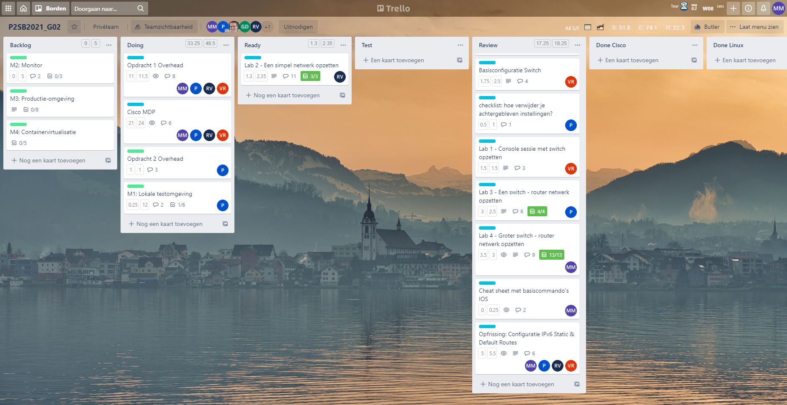
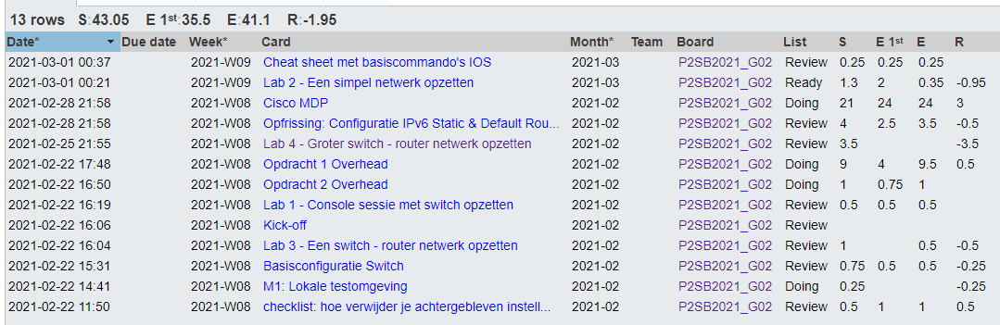
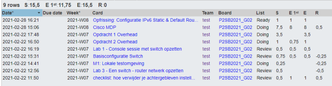
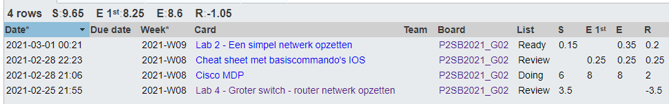
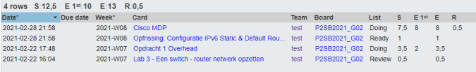

# Voortgangsrapport week 4

* Groep: 02
* Datum voortgangsgesprek: 01/03/2021

| Student          | Aanw. | Opmerking |
| :--------------- | :---- | :-------- |
| Pieter Van Keer  | ok    |           |
| Maurits Monteyne | ok    |           |
| Ruby Verhoye     | ok    |           |
| Vic Rottiers     | ok    |           |

## Wat heb je deze week gerealiseerd?

### Algemeen

* ...

### Pieter Van Keer

* Linux M1 gestart
* Workshop MDP doorlopen
* Labo's van Vic getest
* Labo 3 afgewerkt

### Maurits Monteyne

* Opdracht 1 - Lab 4
* Workshop MDP doorlopen
* Cheat sheet met basiscommando’s IOS
* Opdracht 1 - Lab 2 getest

### Ruby Verhoye 

* Opfrissing IPv6  
* Lab 2 afgewerkt

### Vic Rottiers

* Lab 3 van Pieter Getest 
* Cisco MDP
* Opfrissing IPv6

## Wat plan je volgende week te doen?

### Algemeen
* Opdracht 2

### Pieter Van Keer

### Maurits Monteyne
* Opdracht 1 - Lab 2 opnieuw testen

### Ruby Verhoye

### Vic Rottiers
* M4 van opdracht 2

## Waar hebben jullie nog problemen mee?
* Workshop MDP kan niet afgewerkt worden.

## Feedback technisch luik

### Algemeen

* Opdracht 1
    * Labo 1, 2, 3 en 4 gedemonstreerd en toegelicht, ok
    * Checklist reset: is heel summier! Reset-procedure aanvullen met het geval dat er een onbekend admin-wachtwoord ingesteld is.
    * Cisco MBP - labo's 2.7-2.9 lukken niet, zal gemeld worden aan de collega's Computernetwerken.
* Opdracht 2, mee begonnen (testen Vagrant)

### Pieter Van Keer
### Maurits Monteyne
### Ruby Verhoye
### Vic Rottiers

## Feedback analyseluik

### Algemeen

### Pieter Van Keer
### Maurits Monteyne
### Ruby Verhoye
### Vic Rottiers

