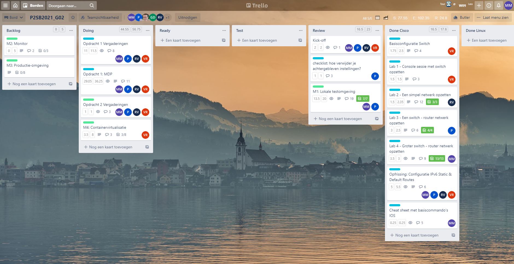
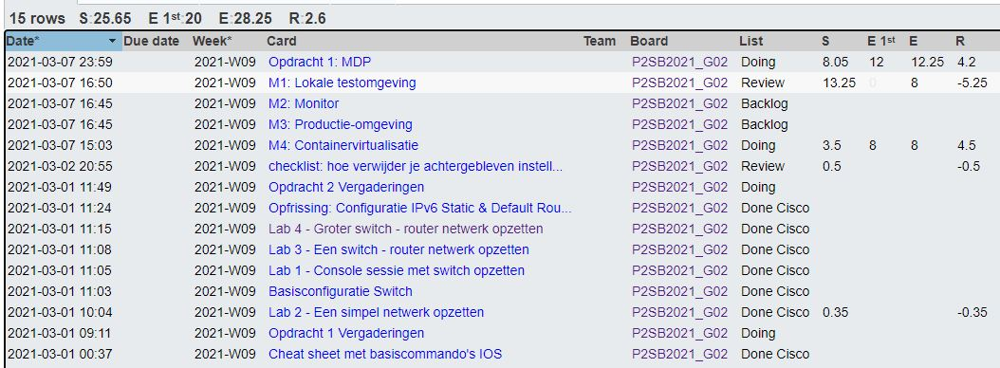
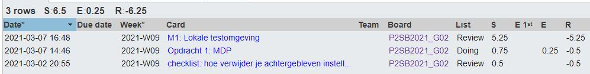
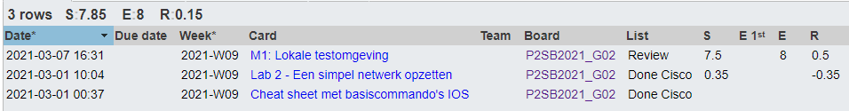
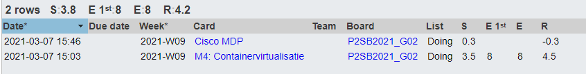

# Voortgangsrapport week 5

* Groep: 02
* Datum voortgangsgesprek: 08/03/2021

| Student          | Aanw. | Opmerking |
| :--------------- | :---- | :-------- |
| Pieter Van Keer  | ok    |           |
| Maurits Monteyne | ok    |           |
| Ruby Verhoye     | ok    |           |
| Vic Rottiers     | ok    |           |

## Wat heb je deze week gerealiseerd?

### Algemeen

* Taken verdeeld voor opdracht 02

### Pieter Van Keer

* M1 gemaakt samen met Maurits
* Checklist cisco verbeterd
* Cisco MDP end of course Survey en Exam gemaakt.

### Maurits Monteyne

* Opdracht 2 - M1 gemaakt met Pieter
* Opdracht 1 - Lab 2 opnieuw getest

### Ruby Verhoye 

* Cisco MDP Python afgewerkt

### Vic Rottiers

* M4 afwerken -> halfweg.
* M1 getest.
* MDP end of course survey gemaakt.

## Wat plan je volgende week te doen?

### Algemeen
### Pieter Van Keer
- M3 starten
### Maurits Monteyne
- Opdracht 2 - M2 testen
### Ruby Verhoye
- Opdracht 2 - M2 uitvoeren
- Cisco MDP verder werken
### Vic Rottiers
- M4 verder afwerken.

## Waar hebben jullie nog problemen mee?

* **Vic**
    * had probleem met Vagrant op computer -> private_key wordt niet automatisch gegenerate door vagrant -> ssh timeout
    * geen problemen op laptop
    * -> Morgen troubleshooten

## Feedback technisch luik

### Algemeen

* Opdracht 1 (Cisco)
    * Resetprocedure bijgewerkt, ok!
* Opdracht 2 (Linux) M1
    * Script overlopen, is goed geschreven! Gebruik van variabelen en functies
    * Webserver enkel op poort 80, graag ook ondersteuning voor TLS/SSL (https, poort 443)

### Pieter Van Keer
### Maurits Monteyne
### Ruby Verhoye
### Vic Rottiers

## Feedback analyseluik

### Algemeen

### Pieter Van Keer
### Maurits Monteyne
### Ruby Verhoye
### Vic Rottiers

