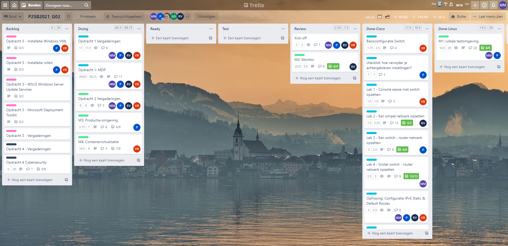
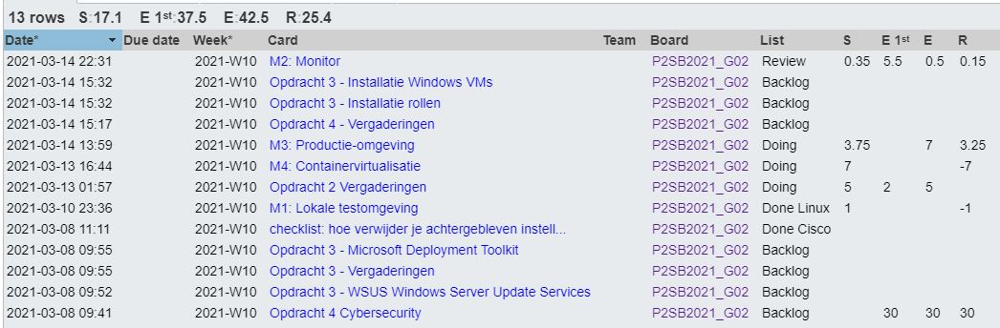
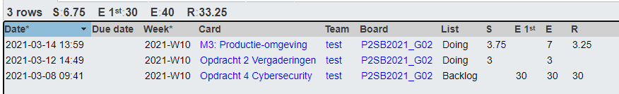
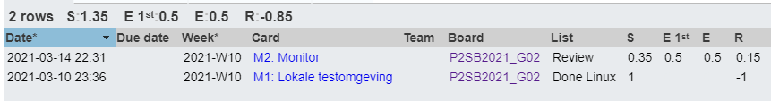
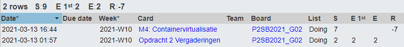

# Voortgangsrapport week 6

* Groep: 02
* Datum voortgangsgesprek: 15/03/2021

| Student          | Aanw. | Opmerking |
| :--------------- | :---- | :-------- |
| Pieter Van Keer  | ok    |           |
| Maurits Monteyne | ok    |           |
| Ruby Verhoye     | ok    |           |
| Vic Rottiers     | ok    |           |

## Wat heb je deze week gerealiseerd?

### Algemeen

* Opdrachten 3 en 4 ingedeeld

### Pieter Van Keer

* aan M3 gewerkt, dit is bijna klaar

### Maurits Monteyne

* Opdracht 2 - M1 HTTPS
* Opdracht 2 - M2 getest

### Ruby Verhoye 

* Opdracht 2 - M2 gemaakt

### Vic Rottiers

* aan M4 gewerkt, dit is 90% klaar.

## Wat plan je volgende week te doen?

### Algemeen
### Pieter Van Keer
* Starten met Opdracht 3
### Maurits Monteyne
* Starten met Opdracht 3
### Ruby Verhoye
### Vic Rottiers
* Opdracht 2: M4 afwerken, beginnen met opdracht 3
## Waar hebben jullie nog problemen mee?

* Voor M3 hebben we gekozen voor Azure, we krijgen $100 maar de hosting kost $59.10/maand: Hoelang moet deze vm draaien?
    * Enkel op het moment dat je de demo toont, daarna zet je die terug uit
* Cockpit Docker container support?
    * Normaal is het voldoende om een plugin te installeren
    * Als je Ubuntu als VM gebruikt, is het mogelijk dat Cockpit niet goed geïntegreerd is (Cockpit is een RedHat-product). In dat geval is [Portainer](https://www.portainer.io/) misschien een goed alternatief.
* Hoe kunnen we de VM op Azure delen met het team?
    * Niet. Ieder teamlid zet best zelf Azure op en maakt nieuwe VM aan om opstelling te reproduceren
* We krijgen een 503 service not available error, kunnen we dit verhelpen door het quota te verhogen van de VM (Azure)
    * Logs in `/var/www/html` lijken geen foutboodschappen te bevatten
    * Probeer eens in de VM zelf `curl localhost/wordpress`. Als je de pagina krijgt (wordt afgedrukt op stdout), dan is het inderdaad een Azure-probleem. Als je ook een 503 krijgt, ligt het aan de internet configuratie van de server
    * Stel de vraag evt. op het algemene Team, mss heeft iemand anders een idee van wat er aan de hand kan zijn
* Opdracht 3: moeten de servers ook geautomatiseerd zijn?
    * De DC en MDT-server moeten niet geautomatiseerd zijn, maar als je het wel doet (ahv PowerShell-script bijvoorbeeld) krijg je een hogere score op deze opdracht

## Feedback technisch luik

* Opdracht 2, M2 getoond
    * Evt. screenshot van Cockpit als de webserver overbelast wordt. Welke resource raakt het eerst gesatureerd
* Vragen (zie hierboven) overlopen en beantwoord.

### Algemeen

### Pieter Van Keer
### Maurits Monteyne
### Ruby Verhoye
### Vic Rottiers

## Feedback analyseluik

### Algemeen

### Pieter Van Keer
### Maurits Monteyne
### Ruby Verhoye
### Vic Rottiers

