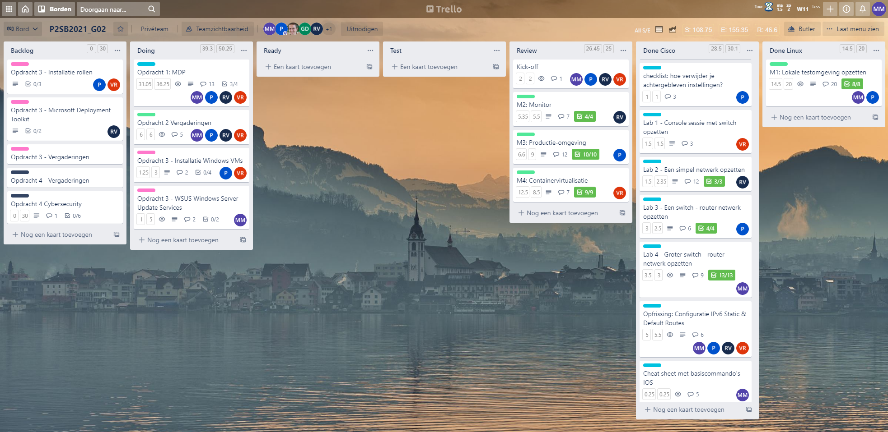
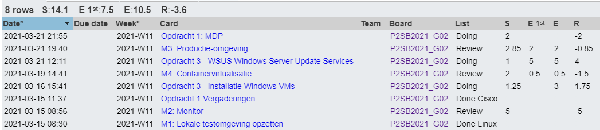
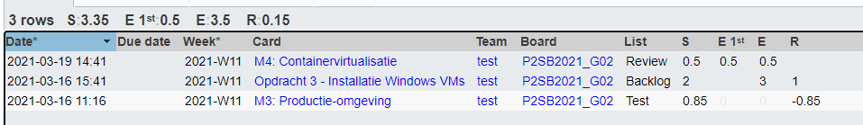
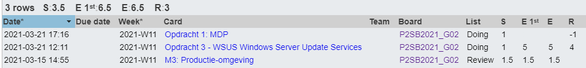
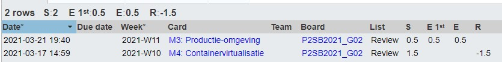

# Voortgangsrapport week 07

* Groep: 02
* Datum voortgangsgesprek: 22/03/2021

| Student          | Aanw. | Opmerking |
| :--------------- | :---- | :-------- |
| Pieter Van Keer  |       |           |
| Maurits Monteyne |       |           |
| Ruby Verhoye     |       |           |
| Vic Rottiers     |       |           |

## Wat heb je deze week gerealiseerd?

### Algemeen

* Opdrachten 3 verdeeld

### Pieter Van Keer

* M3 afgewerkt
* Begonnen aan Opdracht 3
* M4 getest

### Maurits Monteyne

* Opdracht 1 - MDP Final exam
* Opdracht 2 - M3 debugging
* Opdracht 3 - Research WSUS

### Ruby Verhoye 

* Opdracht 1 - MDP verder gedaan

### Vic Rottiers

* M4 afgewerkt
* M3 getest

## Wat plan je volgende week te doen?

### Algemeen
### Pieter Van Keer

* verder werken aan opdracht 3

### Maurits Monteyne
* Opdracht 3 - WSUS verder werken
### Ruby Verhoye
### Vic Rottiers
* Verder werken aan opdracht 3

## Waar hebben jullie nog problemen mee?

* ...
* ...

## Feedback technisch luik

### Algemeen

### Pieter Van Keer
### Maurits Monteyne
### Ruby Verhoye
### Vic Rottiers

## Feedback analyseluik

* Opdracht 2
    * M3 (Cloud) gedemonstreerd
        * CentOS8 image gebruikt
        * Installatiescript aangepast voor gebruik op de webserver
    * M2 (Cockpit + load tests)
        * Webserver lijkt niet overbelast te raken
    * M4 (Containervirtualisatie)
        * Installatie VM is manueel - graag automatiseren zodat je deze VM met `vagrant up` kan reproduceren
* Opdracht 3
    * Hoe configuratiebestanden in PowerShell inlezen?
        * Kijk naar het JSON-formaat, en [ConvertFrom-JSON](https://docs.microsoft.com/en-us/powershell/module/microsoft.powershell.utility/convertfrom-json?view=powershell-7.1)

### Algemeen

### Pieter Van Keer
### Maurits Monteyne
### Ruby Verhoye
### Vic Rottiers

