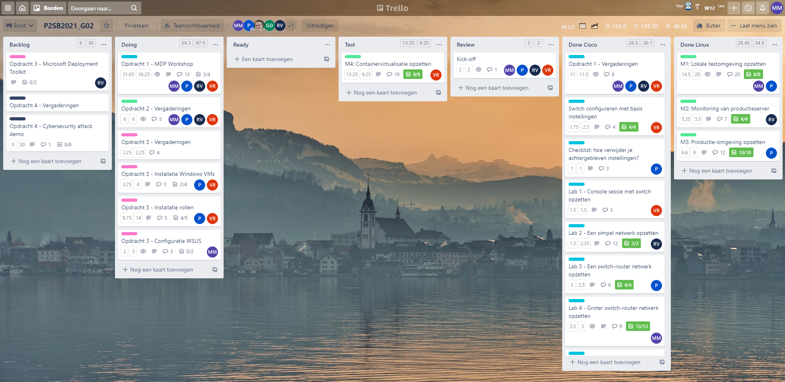
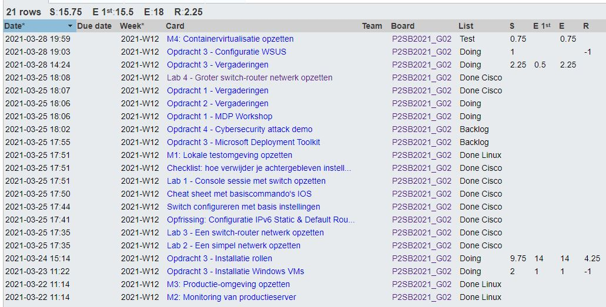
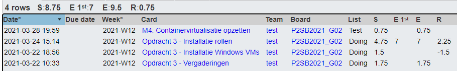
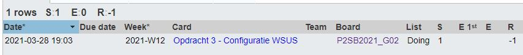
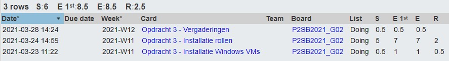

# Voortgangsrapport week n8

* Groep: 02
* Datum voortgangsgesprek:

| Student          | Aanw. | Opmerking |
| :--------------- | :---- | :-------- |
| Pieter Van Keer  | ok    |           |
| Maurits Monteyne | ok    |           |
| Ruby Verhoye     | ok    |           |
| Vic Rottiers     | ok    |           |

## Wat heb je deze week gerealiseerd?

### Algemeen

* ...

### Pieter Van Keer

* De eerste 2 deelopdrachten van Opdracht 3 bijna afgewerkt samen met Vic. Nog kleine aanpassingen en vervolledigingen zijn nodig.
* M4 getest.

### Maurits Monteyne

* Opdracht 3 - WSUS configuren
* Omschrijvingen opdracht 1 aanpassen

### Ruby Verhoye 

* ...

### Vic Rottiers

* De eerste 2 deelopdrachten van Opdracht 3 bijna afgewerkt samen met Pieter. Nog kleine aanpassingen en vervolledigingen zijn nodig.
* M4: vagrant setup in orde gebracht

## Wat plan je volgende week te doen?

### Algemeen
### Pieter Van Keer
- Eerste 2 deelopdrachten samen met Pieter verder afwerken
- Nadenken over een idee voor Opdracht 4
### Maurits Monteyne
### Ruby Verhoye
### Vic Rottiers
- Eerste 2 deelopdrachten samen met Pieter verder afwerken
- Nadenken over een idee voor Opdracht 4

## Waar hebben jullie nog problemen mee?

* Moeten de updates voor Windows lokaal staan?
    * Nee, dat moet niet
* Synchroniseren WSUS duurt zeer lang (meerdere uren), is dit normaal?
* Geen info te vinden over hoe bepaalde updates wel in het Nederlands mogen en andere niet

-> Andere vragen best stellen op het algemene Team.

## Feedback technisch luik

### Algemeen

* Opdracht 2 (Webserver)
    * M4 gedemonstreerd, `vagrant up` tot werkende opstelling zonder tussenkomst. Vagrantfile aangepast, roept zelf automatisch `docker compose` op. Ook Portainer en Cockpit geïnstalleerd.
* Bezig met opdracht 3
* Opdracht 4 nog niet gestart, moeten nog beslissen over welke demo ze willen geven.

Goed op schema, maar verdeel het werk goed voor de laatste weken!

### Pieter Van Keer
### Maurits Monteyne
### Ruby Verhoye
### Vic Rottiers

## Feedback analyseluik

### Algemeen

### Pieter Van Keer
### Maurits Monteyne
### Ruby Verhoye
### Vic Rottiers

