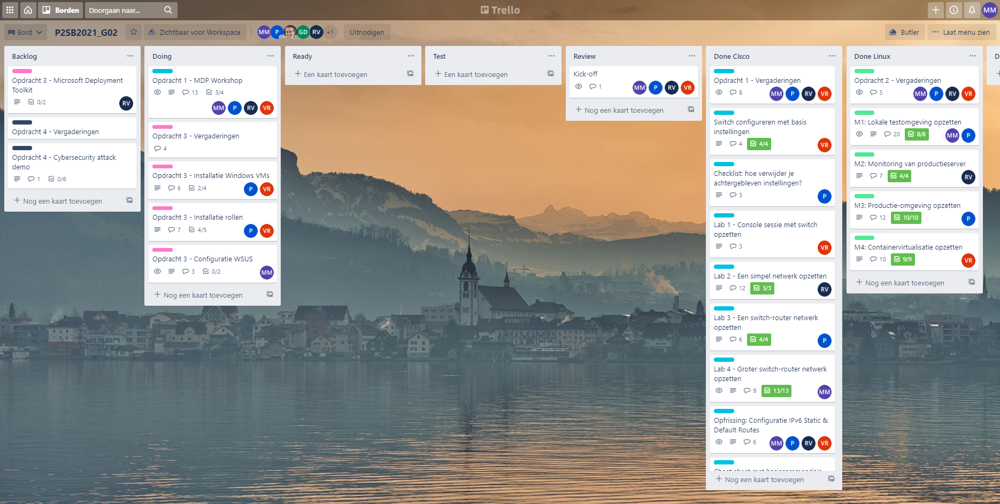
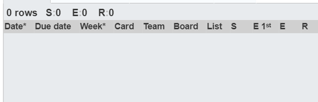
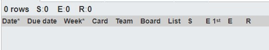

# Voortgangsrapport week 9

* Groep: 02
* Datum voortgangsgesprek: 18/04/2021

| Student          | Aanw. | Opmerking |
| :--------------- | :---- | :-------- |
| Pieter Van Keer  |       |           |
| Maurits Monteyne |       |           |
| Ruby Verhoye     |       |           |
| Vic Rottiers     |       |           |

## Wat heb je deze week gerealiseerd?

### Algemeen

* /

### Pieter Van Keer

* /

### Maurits Monteyne

* /

### Ruby Verhoye 

![Tijdsregistratie Ruby]

### Vic Rottiers

* /

## Wat plan je volgende week te doen?

### Algemeen
### Pieter Van Keer
* Opdracht 4
### Maurits Monteyne
### Ruby Verhoye
### Vic Rottiers
* Laatste check up van opdracht 3, technische documentatie schrijven
* Opdracht 4

## Waar hebben jullie nog problemen mee?

* ...

## Feedback technisch luik

### Algemeen

### Pieter Van Keer
### Maurits Monteyne
### Ruby Verhoye
### Vic Rottiers

## Feedback analyseluik

### Algemeen

### Pieter Van Keer
### Maurits Monteyne
### Ruby Verhoye
### Vic Rottiers

