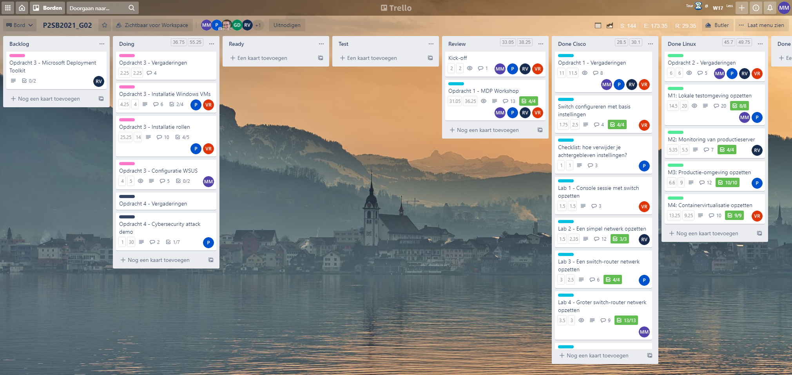

# Voortgangsrapport week 10

* Groep: 02
* Datum voortgangsgesprek: 26/04/2021

| Student          | Aanw. | Opmerking |
| :--------------- | :---- | :-------- |
| Pieter Van Keer  |       |           |
| Maurits Monteyne |       |           |
| Ruby Verhoye     |       |           |
| Vic Rottiers     |       |           |

## Wat heb je deze week gerealiseerd?

### Algemeen

* Cyber attack gekozen

### Pieter Van Keer

* Verder gewerkt aan Opdracht 3
* Gestart aan opdracht 4
* fysiek labo

### Maurits Monteyne

* Verder gewerkt aan Opdracht 3
* Conceptueel model Opdracht 3 & 4
* Fysiek labo Opdracht 1 - lab 4

### Ruby Verhoye 

* Afwerken MDP

### Vic Rottiers

* Afwerking van Technische documentatie.
* Verder gewerkt aan opdracht 3

## Wat plan je volgende week te doen?

### Algemeen
### Pieter Van Keer
- Opdracht 4 uitvoeren
- Opdracht 3 afwerken
### Maurits Monteyne
- Opdracht 3 WSUS afronden
### Ruby Verhoye
### Vic Rottiers
- Opdracht 3 klaar hebben
- Opdracht 4 uitvoeren
## Waar hebben jullie nog problemen mee?

* ...
* ...

## Feedback technisch luik

### Algemeen

Verslaggeving

- Niet zo veel vooruitgang sinds vorig contactmoment (W8)
- Uren fysiek labo zijn niet opgenomen in tijdregistratie, graag aanvullen!

Opdracht 3 (MDT)

- Work in progress, doel is om dit volgende week af te hebben

Opdracht 4 (Cybersecurity): Feedback gegeven over voorgestelde opstelling

- Man-in-the-middle d.m.v. ARP-cache poisoning
- Hoe LAN gateway opzetten?
    - -> Er bestaan router-distributies (bv. VyOS) waarmee je relatief makkelijk een router-VM kan installeren. Router heeft dan NAT-interface + Host-only. VM van de "gebruiker" en de "attacker" zijn dan beide enkel op die Host-only interface aangesloten.
    - Eventueel gebruik je de Wordpress-webserver uit het vorige labo? Dan blijft de demo binnen het LAN en heb je geen router nodig.
- Enkel tonen dat ARP-table verkeerde info bevat of er ook iets mee doen?
    - Dat laatste! Bv. gebruiker logt in op het Wordpress dashboard op de webserver (dat mag voor mijn part ongeëncrypteerd, dus via HTTP/poort 80). Toon aan dat je vanop het systeem van de attacker het wachtwoord onderschept hebt.
- Live demo of filmpje?
    - Live!

### Pieter Van Keer
### Maurits Monteyne
### Ruby Verhoye
### Vic Rottiers

## Feedback analyseluik

### Algemeen

### Pieter Van Keer
### Maurits Monteyne
### Ruby Verhoye
### Vic Rottiers

