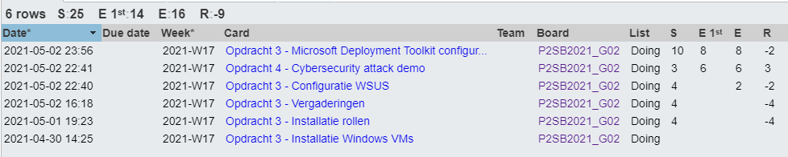

# Voortgangsrapport week 11

* Groep: 02
* Datum voortgangsgesprek:

| Student          | Aanw. | Opmerking |
| :--------------- | :---- | :-------- |
| Pieter Van Keer  | ok    |           |
| Maurits Monteyne | ok    |           |
| Ruby Verhoye     | ok    |           |
| Vic Rottiers     | ok    |           |

## Wat heb je deze week gerealiseerd?

### Algemeen

* ...

### Pieter Van Keer

* Opdracht 3 klaargemaakt voor de demo. enkel MDT moet nog gebeuren

### Maurits Monteyne

* Opdracht 3 - WSUS implementatie afgerond
* Opdracht 4 - Demo voorbereid

### Ruby Verhoye 

* Opdracht 3 Client image afgewerkt (moet nog getest worden door problemen met mijn server)

### Vic Rottiers

* opdracht 3 afgewerkt.

## Wat plan je volgende week te doen?

### Algemeen
### Pieter Van Keer
- Opdracht 3 demo opnemen
### Maurits Monteyne
- Opdracht 3 testen
- Opdracht 4 afwerken
### Ruby Verhoye
### Vic Rottiers
- Opdracht 4 afgewerkt.

## Waar hebben jullie nog problemen mee?

* ...
* ...

## Feedback technisch luik

### Algemeen

Opdracht 3 (MDT)

- Opstelling staat bijna klaar, nog probleem met aanmaken images
- Opstelling kan automatisch opgezet worden ahv PowerShell (scripts zouden wel niet in alle gevallen volledig werken)
    - Opgedeeld in verschillende scripts: basisinstallatie, ADDS, DNS, WSUS, DHCP
    - Settings worden ingelezen via JSON-bestand

Opdracht 4 (Cybersecurity)

- MitM attack via ARP cache spoofing
- Fedora client wil website gebruiken op webserver uit opdracht 2
- Aanvaller (Kali VM) zit op zelfde netwerk
- Via Ettercap client en server als "target" instellen
- Als client naar de website surft en wachtwoord intikt, is dat te zien op de machine van de aanvaller

### Pieter Van Keer
### Maurits Monteyne
### Ruby Verhoye
### Vic Rottiers

## Feedback analyseluik

### Algemeen

### Pieter Van Keer
### Maurits Monteyne
### Ruby Verhoye
### Vic Rottiers

