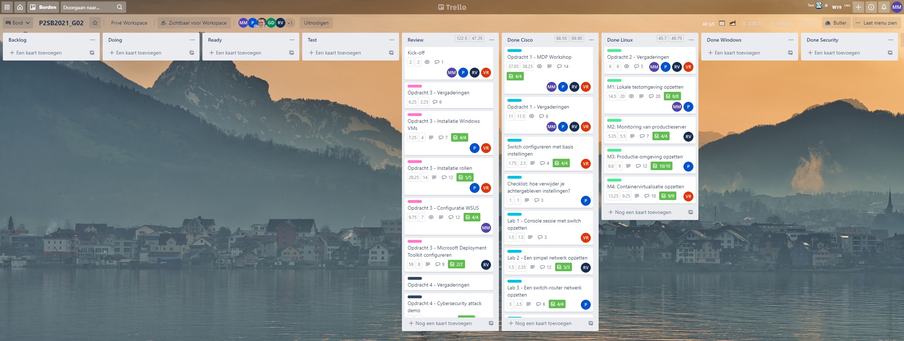
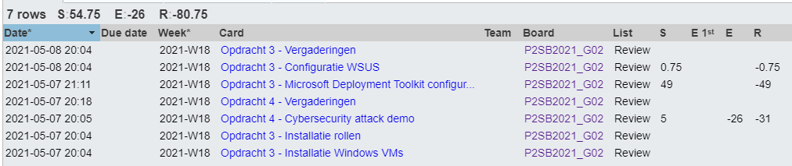
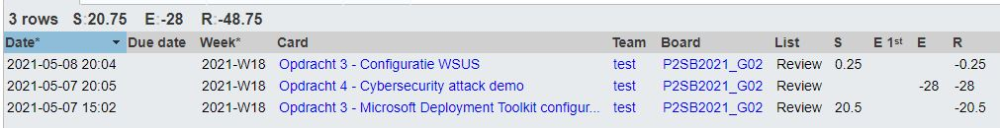
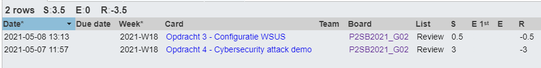
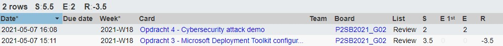

# Voortgangsrapport week 12

* Groep: 02
* Datum voortgangsgesprek: 10/05/2021

| Student          | Aanw. | Opmerking |
| :--------------- | :---- | :-------- |
| Pieter Van Keer  | ok    |           |
| Maurits Monteyne | ok    |           |
| Ruby Verhoye     | ok    |           |
| Vic Rottiers     | ok    |           |

## Wat heb je deze week gerealiseerd?

### Algemeen

* ...

### Pieter Van Keer

* Opdracht 3 MDT - Opdracht gemaakt.
* Opdracht 3 MDT - Technische documentatie geschreven
* Opdracht 3 MDT - Testplan geschreven.
* Opdracht 3 - Demo opgenomen.
* Opdracht 3 WSUS - testrapport geschreven.
* Lastenboeken nagekeken. 

### Maurits Monteyne

* Opdracht 3 - WSUS testplan
* Opdracht 4 - Technische documentatie + testomgeving
* Controle van analyse

### Ruby Verhoye 

* Opdracht 3 - MDT configureren
* Gantt chart opstellen
* Opdracht 4 - Lastenboek

### Vic Rottiers

* Filmpje opdracht 3 demo gemonteerd
* Tests gedaan opdracht 3
* White paper geschreven opdracht 4

## Wat plan je volgende week te doen?

### Algemeen
### Pieter Van Keer
- n.v.t
### Maurits Monteyne
### Ruby Verhoye
### Vic Rottiers
- n.v.t

## Waar hebben jullie nog problemen mee?

* ...
* ...

## Feedback technisch luik

### Algemeen

Opdracht 3 (MDT)

- Demo ahv filmpje: <https://hogent-my.sharepoint.com/:v:/g/personal/vic_rottiers_student_hogent_be/EQq2xfh6KuNIu4wv5R3d0CABvRrdK9l_eYBSjvraTdgXGA?e=epnR7s>

Opdracht 4 (Cybersecurity demo)

- Whitepaper, technische docs afgewerkt (nog na te kijken door begeleider)

### Pieter Van Keer
### Maurits Monteyne
### Ruby Verhoye
### Vic Rottiers

## Feedback analyseluik

### Algemeen

### Pieter Van Keer
### Maurits Monteyne
### Ruby Verhoye
### Vic Rottiers

